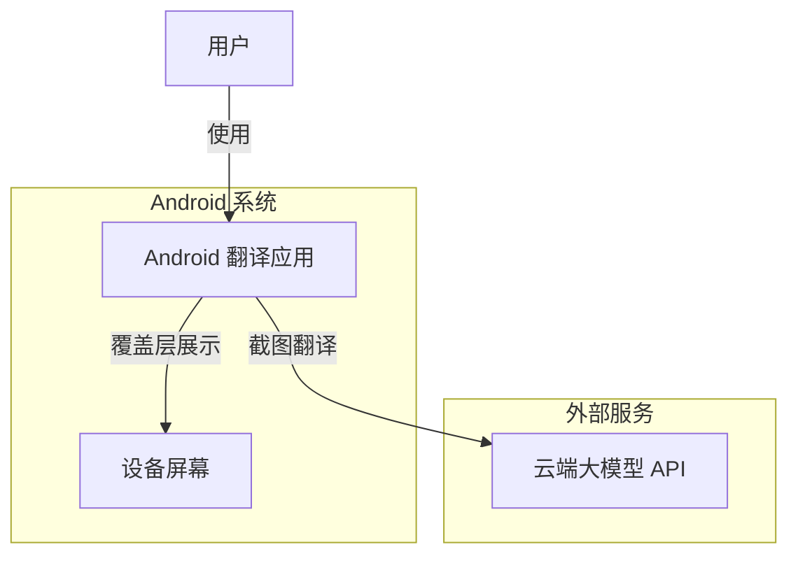
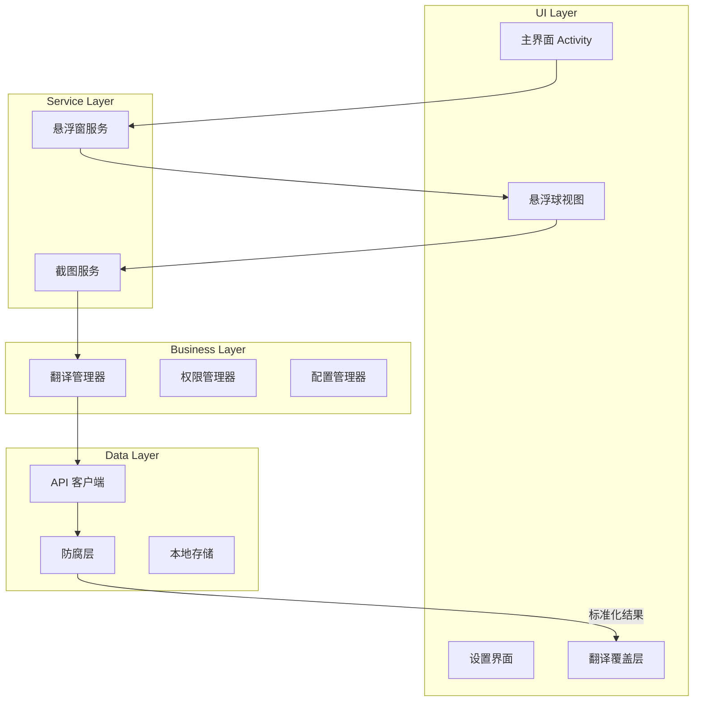
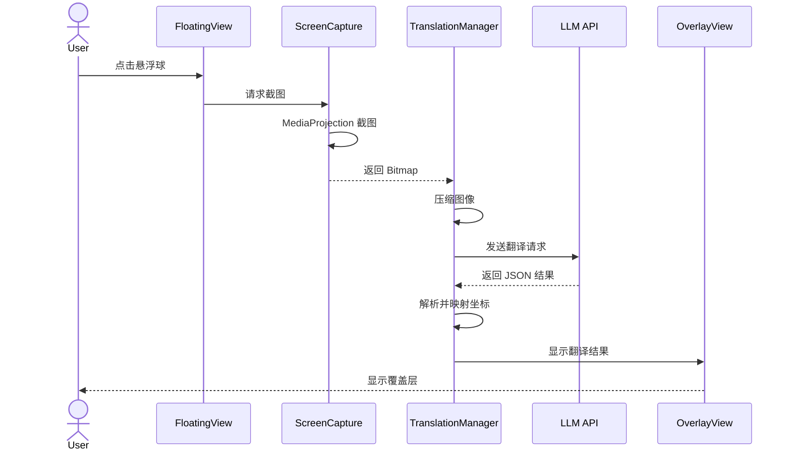
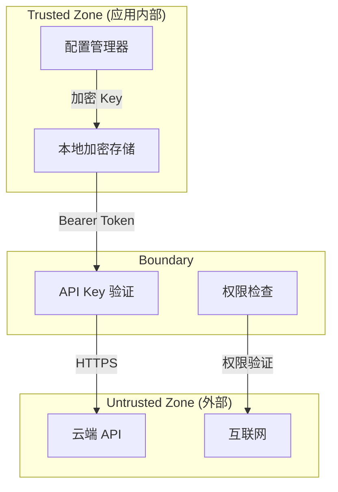
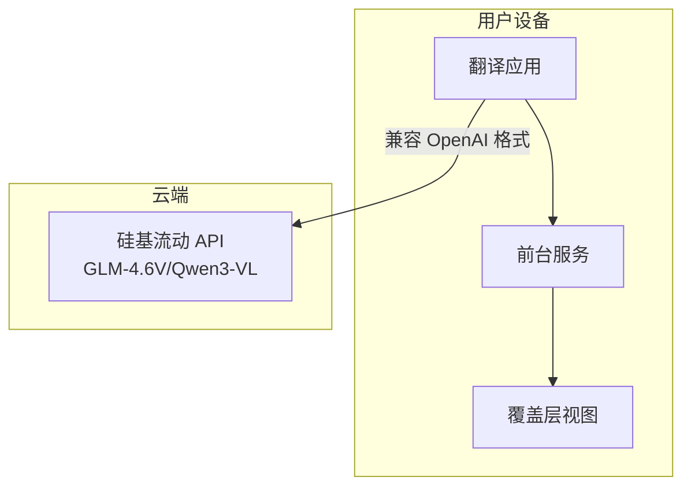

# System Architecture Design

**Document Version:** 1.1
**Last Updated:** 2025-02-10
**Status:** DRAFT

---

## 1. Overview

### 1.1 System Purpose

本系统是一个 Android 原生应用，通过悬浮窗界面和 MediaProjection API 实现全局屏幕翻译功能。系统利用云端多模态大模型进行 OCR 和翻译，将结果以覆盖层形式展示在原位置。

### 1.2 Scope

**包含:**
- Android 客户端应用（全部功能）
- 与云端大模型 API 的集成
- 悬浮窗和覆盖层渲染

**不包含:**
- 自建后端服务（直接调用第三方 API）
- iOS 平台支持
- Web 界面

### 1.3 Design Principles

- **分离关注点:** UI、业务逻辑、平台特定代码分离
- **防腐层模式:** 通过防腐层隔离外部 API 结构，保持系统内部模型独立
- **Kotlin 优先:** 充分利用 Kotlin 特性（协程、空安全）
- **响应式设计:** 使用 Jetpack Compose 实现声明式 UI
- **权限最小化:** 仅请求必要的系统权限

---

## 2. High-Level Architecture

### 2.1 System Context



### 2.2 Component Overview



### 2.3 Technology Stack

| Layer | Technology | Version | Purpose |
|-------|-----------|---------|---------|
| **UI Framework** | Jetpack Compose | 1.10.0 | 声明式 UI |
| **Material Design** | Material3 | 1.10.0-alpha05 | UI 组件库 |
| **语言** | Kotlin | 2.3.0 | 主要开发语言 |
| **构建工具** | Gradle (Kotlin DSL) | - | 构建和依赖管理 |
| **多平台框架** | Compose Multiplatform | 1.10.0 | 跨平台代码共享 |
| **协程** | Kotlinx Coroutines | - | 异步处理 |
| **网络** | Ktor / OkHttp | - | HTTP 请求 |
| **序列化** | Kotlinx Serialization | - | JSON 解析 |
| **生命周期** | Lifecycle ViewModel | 2.9.6 | 生命周期感知 |

---

## 3. Component Design

### 3.1 MainActivity

**Purpose:** 应用入口，提供设置界面和启动悬浮窗服务。

**Responsibilities:**
- 显示语言选择界面
- 显示 API Key 配置界面
- 引导用户授予必要权限
- 启动悬浮窗服务

**Interfaces:**
| Interface | Type | Description |
|-----------|------|-------------|
| onCreate() | Lifecycle | 初始化界面 |
| requestPermissions() | User Action | 请求悬浮窗和录屏权限 |
| startFloatingService() | Intent | 启动悬浮窗服务 |

**Dependencies:**
- PermissionManager
- ConfigManager
- FloatingService

---

### 3.2 FloatingService

**Purpose:** 前台服务，管理悬浮球和覆盖层。

**Responsibilities:**
- 保持应用在后台运行
- 显示和管理悬浮球
- 处理悬浮球点击事件
- 管理覆盖层的显示和隐藏

**Interfaces:**
| Interface | Type | Description |
|-----------|------|-------------|
| onCreate() | Lifecycle | 初始化服务 |
| onStartCommand() | Lifecycle | 处理服务启动命令 |
| addFloatingView() | WindowManager | 添加悬浮球到窗口 |
| removeFloatingView() | WindowManager | 移除悬浮球 |
| showOverlay() | View | 显示翻译覆盖层 |
| hideOverlay() | View | 隐藏翻译覆盖层 |

**Dependencies:**
- WindowManager
- TranslationManager
- FloatingView
- OverlayView

---

### 3.3 ScreenCapture

**Purpose:** 使用 MediaProjection API 截取屏幕内容。

**Responsibilities:**
- 请求录屏权限
- 创建 VirtualDisplay
- 从 ImageReader 获取图像
- 将图像转换为 Bitmap

**Interfaces:**
| Interface | Type | Description |
|-----------|------|-------------|
| requestPermission() | Intent | 请求录屏权限 |
| startCapture() | MediaProjection | 开始截图 |
| captureScreen() | Bitmap | 获取当前屏幕截图 |
| stopCapture() | MediaProjection | 停止截图 |

**Dependencies:**
- MediaProjectionManager
- MediaProjection
- ImageReader
- VirtualDisplay

---

### 3.4 TranslationManager

**Purpose:** 协调截图、API 调用和结果处理。

**Responsibilities:**
- 触发屏幕截图
- 压缩和编码图像
- 调用云端 API
- 解析返回的 JSON
- 映射坐标到屏幕尺寸

**Interfaces:**
| Interface | Type | Description |
|-----------|------|-------------|
| translate() | suspend fun | 执行翻译流程 |
| preprocessImage() | fun | 图像预处理 |
| mapCoordinates() | fun | 坐标映射 |

**Dependencies:**
- ScreenCapture
- TranslationApiClient
- OverlayView

---

### 3.5 AntiCorruptionLayer (防腐层)

**Purpose:** 隔离外部 API 结构变化，保持系统内部模型的稳定。

**Responsibilities:**
- 将外部 API 响应转换为内部领域模型
- 处理不同 API 提供商的响应格式差异
- 验证和清理外部数据
- 提供统一的错误处理

**Interfaces:**
| Interface | Type | Description |
|-----------|------|-------------|
| convert() | fun | 将外部响应转换为内部模型 |
| validate() | fun | 验证数据有效性 |
| normalize() | fun | 标准化坐标格式 |

**Dependencies:**
- TranslationApiClient
- 外部 API 响应模型

**设计要点:**
```kotlin
// 内部领域模型（独立于外部 API）
data class TranslationResult(
    val originalText: String,
    val translatedText: String,
    val boundingBox: BoundingBox  // 内部坐标模型
)

data class BoundingBox(
    val left: Float,    // 归一化 0-1
    val top: Float,     // 归一化 0-1
    val right: Float,   // 归一化 0-1
    val bottom: Float   // 归一化 0-1
)

// 防腐层接口
interface TranslationApiAdapter {
    suspend fun translate(request: TranslationRequest): List<TranslationResult>
}

// 硅基流动 API 适配器
class SiliconFlowAdapter(
    private val apiClient: ApiClient,
    private val baseUrl: String = "https://api.siliconflow.cn/v1/chat/completions"
) : TranslationApiAdapter {
    override suspend fun translate(request: TranslationRequest): List<TranslationResult> {
        val response = apiClient.post<SiliconFlowResponse>(baseUrl, request.toExternal())
        return response.toInternalModel()  // 转换为内部模型
    }
}
```

---

### 3.6 CoordinateValidator (坐标验证器)

**Purpose:** 处理大模型返回的坐标偏差，提供容错机制。

**Responsibilities:**
- 验证坐标有效性（范围 0-1）
- 扩展过小的坐标框
- 裁剪超出屏幕的坐标
- 处理重叠的文本框

**容错策略:**

| 策略 | 描述 | 触发条件 |
|------|------|----------|
| **边界裁剪** | 将超出 [0,1] 的坐标裁剪到有效范围 | 坐标值 < 0 或 > 1 |
| **最小尺寸扩展** | 将过小的框扩展到最小尺寸 | 宽或高 < 0.02 |
| **中心扩展** | 向四周均匀扩展坐标框 | 坐标框过小 |
| **重叠处理** | 检测并处理重叠的文本框 | 框之间有交集 |

**实现示例:**
```kotlin
class CoordinateValidator(
    private val minBoxSize: Float = 0.02f,  // 最小框尺寸 (屏幕比例)
    private val expansionPadding: Float = 0.01f  // 扩展边距
) {
    fun validateAndAdjust(box: BoundingBox, screenWidth: Int, screenHeight: Int): BoundingBox {
        // 1. 边界裁剪
        val clipped = box.clipToBounds()

        // 2. 检查是否需要扩展
        if (clipped.width < minBoxSize || clipped.height < minBoxSize) {
            return clipped.expandToMinSize(minBoxSize)
        }

        return clipped
    }

    private fun BoundingBox.clipToBounds() = copy(
        left = left.coerceIn(0f, 1f),
        top = top.coerceIn(0f, 1f),
        right = right.coerceIn(0f, 1f),
        bottom = bottom.coerceIn(0f, 1f)
    )

    private fun BoundingBox.expandToMinSize(minSize: Float) = copy(
        left = (left - expansionPadding).coerceAtLeast(0f),
        top = (top - expansionPadding).coerceAtLeast(0f),
        right = (right + expansionPadding).coerceAtMost(1f),
        bottom = (bottom + expansionPadding).coerceAtMost(1f)
    )
}
```

---

### 3.7 TextLayoutEngine (文本排版引擎)

**Purpose:** 处理翻译后文本的自适应排版。

**Responsibilities:**
- 根据可用空间自动调整字体大小
- 处理文本换行
- 支持中英文混合排版
- 计算文本在矩形框内的最佳布局

**排版策略:**

| 策略 | 描述 | 适用场景 |
|------|------|----------|
| **固定字号** | 使用固定字号，超出部分截断 | 文本长度可控 |
| **自适应字号** | 根据框体大小动态调整字号 | 文本长度变化大 |
| **扩展框体** | 保持字号，扩展矩形框 | 允许覆盖更多区域 |
| **多行换行** | 将长文本拆分为多行 | 单行过长 |

**实现示例:**
```kotlin
class TextLayoutEngine(
    private val minTextSize: Float = 12f,     // 最小字号 sp
    private val maxTextSize: Float = 24f,     // 最大字号 sp
    private val defaultTextSize: Float = 16f  // 默认字号 sp
) {
    fun calculateLayout(
        text: String,
        boundingBox: BoundingBox,
        screenWidth: Int,
        screenHeight: Int
    ): TextLayout {
        val boxWidth = boundingBox.width * screenWidth
        val boxHeight = boundingBox.height * screenHeight

        // 使用 Paint 测量文本
        val paint = TextPaint().apply {
            textSize = defaultTextSize
        }

        // 尝试默认字号
        val measured = measureText(text, paint, boxWidth)

        return when {
            // 文本适合框体
            measured.fitsInBox(boxWidth, boxHeight) -> TextLayout(
                textSize = defaultTextSize,
                lines = measured.lines,
                overflow = false
            )
            // 文本过长，缩小字号
            measured.width > boxWidth || measured.height > boxHeight -> {
                val adjustedSize = findOptimalTextSize(text, boxWidth, boxHeight)
                TextLayout(
                    textSize = adjustedSize,
                    lines = measureText(text, paint.apply { textSize = adjustedSize }, boxWidth).lines,
                    overflow = adjustedSize <= minTextSize
                )
            }
            else -> TextLayout(defaultTextSize, emptyList(), false)
        }
    }

    private fun findOptimalTextSize(text: String, width: Float, height: Float): Float {
        // 二分查找最优字号
        var low = minTextSize
        var high = maxTextSize
        var best = minTextSize

        while (low <= high) {
            val mid = (low + high) / 2
            val paint = TextPaint().apply { textSize = mid }
            val measured = measureText(text, paint, width)

            if (measured.fitsInBox(width, height)) {
                best = mid
                low = mid + 1
            } else {
                high = mid - 1
            }
        }

        return best
    }
}
```

---

### 3.8 TranslationApiClient

**Purpose:** 封装与云端大模型 API 的交互。

**Responsibilities:**
- 构建 API 请求
- 上传图像数据
- 解析 API 响应
- 处理 API 错误

**Interfaces:**
| Interface | Type | Description |
|-----------|------|-------------|
| translate() | suspend fun | 发送翻译请求 |
| buildRequest() | fun | 构建请求体 |
| parseResponse() | fun | 解析响应 |

**Dependencies:**
- HTTP 客户端 (Ktor/OkHttp)
- JSON 序列化库

---

### 3.9 OverlayView

**Purpose:** 在屏幕上绘制翻译结果。

**Responsibilities:**
- 创建全屏透明覆盖层
- 根据坐标绘制白色矩形框
- 在矩形框内绘制翻译文本
- 处理文本溢出和换行

**Interfaces:**
| Interface | Type | Description |
|-----------|------|-------------|
| showResults() | fun | 显示翻译结果 |
| clearResults() | fun | 清除翻译结果 |
| onDismiss() | callback | 处理关闭事件 |

**Dependencies:**
- Canvas
- Paint
- WindowManager

---

## 4. Data Architecture

### 4.1 Data Flow



### 4.2 Data Models

| Entity | Attributes | Description |
|--------|------------|-------------|
| **TranslationConfig** | sourceLanguage, targetLanguage, apiKey, provider | 翻译配置 |
| **TranslationRequest** | imageData, prompt, sourceLang, targetLang | API 请求 |
| **TranslationResult** | originalText, translatedText, boundingBox | 单个翻译结果（内部模型） |
| **BoundingBox** | left, top, right, bottom (0-1) | 归一化坐标（内部模型） |
| **TextLayout** | textSize, lines, overflow | 文本排版信息 |

**模型枚举:**
```kotlin
enum class VlmModel(val id: String, val displayName: String) {
    GLM_4_6V("zai-org/GLM-4.6V", "GLM-4.6V"),
    GLM_4_5V("zai-org/GLM-4.5V", "GLM-4.5V"),
    QWEN3_VL_32B("Qwen/Qwen3-VL-32B-Instruct", "Qwen3-VL-32B"),
    QWEN3_VL_30B("Qwen/Qwen3-VL-30B-A3B-Instruct", "Qwen3-VL-30B"),
    QWEN3_VL_235B("Qwen/Qwen3-VL-235B-A22B-Instruct", "Qwen3-VL-235B"),
    QWEN2_5_VL_32B("Qwen/Qwen2.5-VL-32B-Instruct", "Qwen2.5-VL-32B"),
    QWEN2_5_VL_72B("Qwen/Qwen2.5-VL-72B-Instruct", "Qwen2.5-VL-72B")
}
```

### 4.3 State Management

| State Type | Storage | Scope | Lifecycle |
|------------|---------|-------|-----------|
| **UI State** | remember | Composable | 组合生命周期 |
| **Service State** | Service 实例 | 应用全局 | 服务生命周期 |
| **配置状态** | DataStore | 应用全局 | 持久化 |
| **翻译结果** | StateFlow | OverlayView | 单次会话 |

---

## 5. Communication Protocols

### 5.1 Inter-Component Communication

| Type | Mechanism | Format | Use Case |
|------|-----------|--------|----------|
| **同步** | 函数调用 | Kotlin 对象 | UI 组件间通信 |
| **异步** | 协程 | suspend 函数 | 网络请求、图像处理 |
| **事件** | Flow / StateFlow | 数据流 | 状态更新通知 |
| **Intent** | Intent | Bundle | 启动 Activity/Service |

### 5.2 External Interfaces

| System | Protocol | Authentication | Data Format |
|--------|----------|----------------|-------------|
| **硅基流动 API** | HTTPS | Bearer Token (用户自备) | JSON (OpenAI 兼容格式) |

---

## 6. Security Architecture

### 6.1 Security Boundaries



### 6.2 Authentication & Authorization

| Mechanism | Used By | Purpose |
|-----------|---------|---------|
| API Key | LLM API | 识别和计费 |
| Keystore | LocalStorage | 安全存储 API Key |
| 权限检查 | Android 系统 | 悬浮窗、录屏权限 |

### 6.3 Data Protection

| Data Type | Protection Method | Storage |
|-----------|-------------------|---------|
| API Key | Android Keystore | 本地加密（用户自备） |
| 截图数据 | 仅内存传输，使用后立即销毁 | 不持久化 |
| 用户配置 | DataStore | 本地存储 |
| 网络传输 | TLS 1.2+ | 加密通道 |

### 6.4 Security Controls

- 截图数据仅用于翻译，不在本地保存
- 截图数据使用后立即从内存中清除
- API Key 由用户自行提供，应用不存储集中密钥
- API Key 使用 Android Keystore 加密存储
- 所有网络通信使用 HTTPS
- 定期清理内存中的敏感数据
- 遵循最小权限原则

---

## 7. Deployment Architecture

### 7.1 Deployment Model



### 7.2 Infrastructure Requirements

| Component | CPU | Memory | Storage | Network |
|-----------|-----|--------|---------|---------|
| 应用 | < 5% | < 150MB | < 50MB | 移动网络/Wi-Fi |
| 服务 | < 10% | < 100MB | 0 | - |

### 7.3 Scalability Strategy

| Aspect | Horizontal | Vertical |
|--------|------------|----------|
| 应用实例 | N/A | 单设备 |
| API 调用 | 请求队列 | 批处理 |

---

## 8. Reliability & Availability

### 8.1 Failure Scenarios

| Failure Type | Impact | Mitigation |
|--------------|--------|------------|
| 网络不可用 | 无法翻译 | 显示错误提示，提供重试 |
| API 超时 | 翻译延迟 | 增加超时时间，显示加载状态 |
| 权限被撤销 | 服务停止 | 监听权限变化，提示用户 |
| 系统杀死服务 | 悬浮球消失 | 使用前台服务，引导电池优化 |
| API 错误 | 翻译失败 | 解析错误码，显示友好提示 |

### 8.2 Recovery Mechanisms

- **网络错误**: 自动重试（最多 3 次）
- **权限撤销**: 监听广播，重新请求权限
- **服务被杀**: 使用前台服务和通知保活
- **坐标无效**: 过滤无效坐标，跳过该文本块

### 8.3 Backup Strategy

| Data Type | Backup Frequency | Retention | Location |
|-----------|------------------|-----------|----------|
| 用户配置 | 实时 | 永久 | DataStore |
| 截图数据 | 不备份 | 不保留 | 内存 |

---

## 9. Performance Considerations

### 9.1 Performance Requirements

| Metric | Target | Measurement |
|--------|--------|-------------|
| 截图延迟 | < 500ms | 从触发到获取 Bitmap |
| API 响应时间 | < 5s | 从发送请求到接收结果 |
| 渲染时间 | < 200ms | 绘制覆盖层 |
| 总体延迟 | < 6s | 从点击悬浮球到显示翻译 |

### 9.2 Optimization Strategies

- **图像压缩**: 在保持清晰度的前提下压缩截图
- **坐标缓存**: 缓存屏幕尺寸，避免重复查询
- **懒加载**: 按需加载覆盖层视图
- **协程优化**: 使用 Dispatchers.IO 处理耗时操作

### 9.3 Caching Strategy

| Data Type | Cache Type | TTL | Invalidation |
|-----------|------------|-----|--------------|
| 屏幕尺寸 | 内存 | 应用生命周期 | 配置变化 |
| 语言配置 | DataStore | 永久 | 用户更新 |
| API Key | Keystore | 永久 | 用户更新 |
| 截图数据 | 不缓存 | 使用后立即销毁 | - |

---

## 10. Monitoring & Observability

### 10.1 Metrics

| Metric | Type | Purpose | Alert Threshold |
|--------|------|---------|-----------------|
| API 调用成功率 | Technical | 监控 API 可用性 | < 95% |
| 翻译延迟 | Technical | 性能监控 | > 10s |
| 崩溃率 | Technical | 稳定性监控 | > 1% |
| 日活用户 | Business | 用户活跃度 | - |

### 10.2 Logging

| Log Type | Destination | Retention | Format |
|----------|-------------|-----------|--------|
| 错误日志 | Logcat + 文件 | 7 天 | 文本 |
| API 调用日志 | Logcat | 1 天 | JSON |
| 调试日志 | Logcat | 仅调试版 | 文本 |

### 10.3 Tracing

- 为每个翻译请求分配唯一 ID
- 记录关键步骤的时间戳
- 使用 Timber 库进行结构化日志记录

---

## 11. Technology Decisions

### 11.1 Key Technologies

| Technology | Justification | Alternatives Considered |
|------------|----------------|-------------------------|
| Kotlin | 现代语言，协程支持，空安全 | Java |
| Jetpack Compose | 声明式 UI，高效开发 | XML 布局 |
| MediaProjection | 官方截图 API | 无替代方案 |
| 前台服务 | 保持后台运行 | 后台服务（会被杀死） |
| Ktor | 现代 HTTP 客户端，协程友好 | OkHttp, Retrofit |

### 11.2 Technical Debt

- **无单元测试**: 需要为核心业务逻辑添加测试
- **坐标容错待完善**: 当前实现基础容错，需要更多实际测试数据优化
- **缺少错误恢复**: 需要更完善的错误处理和重试机制

---

## 12. Open Issues

| ID | Issue | Priority |
|----|-------|----------|
| **A-001** | 根据实际使用数据优化坐标容错参数 | P1 |
| **A-002** | 优化图像压缩算法 | P1 |
| **A-003** | 实现电池优化引导流程 | P1 |

---

## Appendix

### A. Acronyms

| Acronym | Definition |
|---------|------------|
| OCR | Optical Character Recognition |
| API | Application Programming Interface |
| LLM | Large Language Model |
| DRM | Digital Rights Management |

### B. References

- Android MediaProjection API 文档
- Kotlin Multiplatform 官方文档
- Jetpack Compose 指南
- 相关 PRD 文档 (02_PRD.md)
