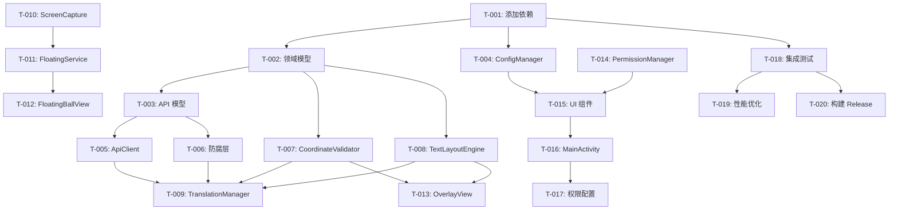

# Task List - cw_1Kito Android 屏幕翻译应用

**Document Version:** 1.0
**Created:** 2025-02-10
**Status:** PLANNING

---

## 1. 项目里程碑

| 里程碑 | 描述 | 预计时间 |
|--------|------|----------|
| **M1: 基础设施** | 数据层、领域模型、工具类 | 3-5 天 |
| **M2: 核心功能** | 翻译流程、截图服务 | 4-6 天 |
| **M3: UI 和服务** | 设置界面、悬浮窗服务 | 4-6 天 |
| **M4: 覆盖层和优化** | 覆盖层绘制、性能优化 | 3-4 天 |
| **M5: 测试和发布** | 测试、修复、打包 | 2-3 天 |

**总计:** 约 16-24 天

---

## 2. P0 任务（必须完成）

### 2.1 数据层模块

#### T-001: 添加项目依赖
**优先级:** P0
**预计时间:** 1 小时
**依赖:** 无

**描述:**
在 `gradle/libs.versions.toml` 中添加所需的依赖库。

**步骤:**
1. 添加 Ktor 网络库依赖
2. 添加 Kotlinx Serialization 依赖
3. 添加 DataStore 依赖
4. 添加加密存储依赖

**交付物:**
- 更新后的 `gradle/libs.versions.toml`
- 更新后的 `composeApp/build.gradle.kts`

**风险点:**
- 依赖版本冲突

**验证标准:**
- 项目可以成功同步
- 无依赖冲突警告

---

#### T-002: 创建领域模型
**优先级:** P0
**预计时间:** 2 小时
**依赖:** T-001

**描述:**
创建应用的核心数据模型。

**文件:**
- `commonMain/kotlin/com/cw2/cw_1kito/model/Language.kt`
- `commonMain/kotlin/com/cw2/cw_1kito/model/VlmModel.kt`
- `commonMain/kotlin/com/cw2/cw_1kito/model/BoundingBox.kt`
- `commonMain/kotlin/com/cw2/cw_1kito/model/TranslationResult.kt`
- `commonMain/kotlin/com/cw2/cw_1kito/model/TranslationConfig.kt`

**TDD 测试用例:**
```kotlin
class BoundingBoxTest {
    @Test
    fun `fromExternal should normalize coordinates from 0-1000 to 0-1`() {
        val coords = listOf(100, 200, 900, 800)
        val box = BoundingBox.fromExternal(coords)
        assertEquals(0.1f, box.left, 0.001f)
        assertEquals(0.2f, box.top, 0.001f)
        assertEquals(0.9f, box.right, 0.001f)
        assertEquals(0.8f, box.bottom, 0.001f)
    }

    @Test
    fun `toScreenRect should convert to pixel coordinates`() {
        val box = BoundingBox(0.1f, 0.2f, 0.9f, 0.8f)
        val rect = box.toScreenRect(1080, 1920)
        assertEquals(108, rect.left)
        assertEquals(384, rect.top)
        assertEquals(972, rect.right)
        assertEquals(1536, rect.bottom)
    }
}
```

**交付物:**
- 所有领域模型文件
- 对应的单元测试

---

#### T-003: 创建 API 模型
**优先级:** P0
**预计时间:** 2 小时
**依赖:** T-002

**描述:**
创建外部 API 的请求和响应模型。

**文件:**
- `commonMain/kotlin/com/cw2/cw_1kito/data/api/SiliconFlowModels.kt`

**TDD 测试用例:**
```kotlin
class SiliconFlowModelsTest {
    @Test
    fun `should serialize request correctly`() {
        val request = SiliconFlowRequest(
            model = "zai-org/GLM-4.6V",
            messages = listOf(/* ... */)
        )
        val json = Json.encodeToString(request)
        assertTrue(json.contains("\"model\":\"zai-org/GLM-4.6V\""))
    }
}
```

**交付物:**
- API 模型文件
- 序列化测试

---

#### T-004: 实现 ConfigManager
**优先级:** P0
**预计时间:** 3 小时
**依赖:** T-001

**描述:**
实现配置管理器，使用 DataStore 持久化用户配置。

**文件:**
- `commonMain/kotlin/com/cw2/cw_1kito/data/config/ConfigManager.kt`
- `androidMain/kotlin/com/cw2/cw_1kito/data/config/ConfigManagerImpl.android.kt`

**TDD 测试用例:**
```kotlin
class ConfigManagerTest {
    @Test
    fun `save and load language config`() = runTest {
        val config = LanguageConfig(Language.EN, Language.ZH)
        manager.saveLanguageConfig(config)
        val loaded = manager.getLanguageConfig()
        assertEquals(config, loaded)
    }

    @Test
    fun `save and load API key`() = runTest {
        manager.saveApiKey("test-key-123")
        val loaded = manager.getApiKey()
        assertEquals("test-key-123", loaded)
    }
}
```

**交付物:**
- ConfigManager 接口和实现
- 单元测试

**风险点:**
- DataStore 初始化可能失败
- 加密存储在不同 Android 版本的兼容性

---

#### T-005: 实现 TranslationApiClient
**优先级:** P0
**预计时间:** 4 小时
**依赖:** T-003, T-004

**描述:**
实现 API 客户端，封装与硅基流动 API 的交互。

**文件:**
- `commonMain/kotlin/com/cw2/cw_1kito/data/api/TranslationApiClient.kt`
- `commonMain/kotlin/com/cw2/cw_1kito/data/api/TranslationApiClientImpl.kt`

**TDD 测试用例:**
```kotlin
class TranslationApiClientTest {
    @Test
    fun `should build correct request`() {
        val request = TranslationApiRequest(
            model = VlmModel.GLM_4_6V,
            imageData = "base64data...",
            targetLanguage = Language.ZH
        )
        val external = adapter.toExternalRequest(request)
        assertEquals("zai-org/GLM-4.6V", external.model)
    }

    @Test
    fun `should handle API error responses`() {
        // 模拟 401 错误
        // 验证返回 ApiException.AuthError
    }
}
```

**交付物:**
- TranslationApiClient 接口和实现
- 单元测试（需要 Mock Ktor client）

**风险点:**
- 网络请求超时处理
- API 响应格式变化

---

#### T-006: 实现 Anti-Corruption Layer
**优先级:** P0
**预计时间:** 3 小时
**依赖:** T-003

**描述:**
实现防腐层适配器，转换外部 API 格式到内部领域模型。

**文件:**
- `commonMain/kotlin/com/cw2/cw_1kito/data/adapter/TranslationApiAdapter.kt`
- `commonMain/kotlin/com/cw2/cw_1kito/data/adapter/SiliconFlowAdapter.kt`

**TDD 测试用例:**
```kotlin
class SiliconFlowAdapterTest {
    @Test
    fun `should convert external response to internal model`() {
        val external = ExternalApiResponse(
            id = "test-id",
            choices = listOf(/* ... */)
        )
        val internal = adapter.toInternalResponse(external)
        assertNotNull(internal.results)
    }

    @Test
    fun `should handle coordinate normalization`() {
        val coords = listOf(0, 0, 1000, 1000)
        val box = BoundingBox.fromExternal(coords)
        assertEquals(0f, box.left)
        assertEquals(1f, box.right)
    }

    @Test
    fun `should clip out of bounds coordinates`() {
        val coords = listOf(-100, -100, 1100, 1100)
        val box = BoundingBox.fromExternal(coords)
        assertEquals(0f, box.left)
        assertEquals(1f, box.right)
    }
}
```

**交付物:**
- TranslationApiAdapter 接口和实现
- 单元测试

**审查反馈 (必须修改):**
- 添加 Markdown 代码块解析处理（LLM 可能返回 ```json 包裹的 JSON）
- 实现多级容错解析：直接解析 → 移除 Markdown 包裹 → 正则提取 JSON

```kotlin
// 需要添加的辅助函数
private fun extractJsonFromContent(content: String): String {
    // 1. 尝试直接解析
    // 2. 失败则尝试移除 Markdown 包裹
    // 3. 失败则尝试正则提取 JSON 数组
}
```

---

### 2.2 领域层模块

#### T-007: 实现 CoordinateValidator
**优先级:** P0
**预计时间:** 3 小时
**依赖:** T-002

**描述:**
实现坐标验证器，处理坐标偏差和容错。

**文件:**
- `commonMain/kotlin/com/cw2/cw_1kito/domain/coordinate/CoordinateValidator.kt`
- `commonMain/kotlin/com/cw2/cw_1kito/domain/coordinate/CoordinateValidatorImpl.kt`

**TDD 测试用例:**
```kotlin
class CoordinateValidatorTest {
    @Test
    fun `should clip out of bounds coordinates`() {
        val box = BoundingBox(-0.1f, -0.1f, 1.1f, 1.1f)
        val validated = validator.validateAndAdjust(box, 1080, 1920)
        assertEquals(0f, validated.left)
        assertEquals(1f, validated.right)
    }

    @Test
    fun `should expand too small boxes`() {
        val box = BoundingBox(0.4f, 0.4f, 0.41f, 0.41f)
        val validated = validator.validateAndAdjust(box, 1080, 1920)
        assertTrue(validated.width >= 0.02f)
        assertTrue(validated.height >= 0.02f)
    }

    @Test
    fun `should resolve overlapping boxes`() {
        val box1 = BoundingBox(0.1f, 0.1f, 0.3f, 0.3f)
        val box2 = BoundingBox(0.2f, 0.2f, 0.4f, 0.4f)
        val results = validator.validateAndAdjustAll(listOf(box1, box2), 1080, 1920)
        // 验证重叠被处理
    }
}
```

**交付物:**
- CoordinateValidator 接口和实现
- 单元测试（覆盖率 > 95%）

---

#### T-008: 实现 TextLayoutEngine
**优先级:** P0
**预计时间:** 4 小时
**依赖:** T-002

**描述:**
实现文本排版引擎，处理自适应字号和多行文本。

**文件:**
- `commonMain/kotlin/com/cw2/cw_1kito/domain/layout/TextLayoutEngine.kt`
- `commonMain/kotlin/com/cw2/cw_1kito/domain/layout/TextLayoutEngineImpl.kt`

**TDD 测试用例:**
```kotlin
class TextLayoutEngineTest {
    @Test
    fun `should calculate optimal text size for short text`() {
        val layout = engine.calculateLayout("Hi", BoundingBox(0.1f, 0.1f, 0.3f, 0.2f), 1080, 1920)
        assertTrue(layout.textSize > 16f) // 短文本可以使用更大字号
    }

    @Test
    fun `should reduce text size for long text`() {
        val longText = "这是一个非常长的文本内容..."
        val layout = engine.calculateLayout(longText, BoundingBox(0.1f, 0.1f, 0.2f, 0.15f), 1080, 1920)
        assertTrue(layout.textSize < 16f) // 长文本应该缩小字号
    }

    @Test
    fun `should split text into multiple lines when needed`() {
        val layout = engine.calculateLayout("Line1\nLine2", /* ... */)
        assertTrue(layout.lines.size >= 2)
    }
}
```

**交付物:**
- TextLayoutEngine 接口和实现
- 单元测试（覆盖率 > 85%）

**风险点:**
- 中英文混合文本的测量
- 不同字体的渲染差异

---

#### T-009: 实现 TranslationManager
**优先级:** P0
**预计时间:** 4 小时
**依赖:** T-005, T-006, T-007, T-008

**描述:**
实现翻译管理器，协调完整的翻译流程。

**文件:**
- `commonMain/kotlin/com/cw2/cw_1kito/domain/translation/TranslationManager.kt`
- `commonMain/kotlin/com/cw2/cw_1kito/domain/translation/TranslationManagerImpl.kt`

**TDD 测试用例:**
```kotlin
class TranslationManagerTest {
    @Test
    fun `should complete translation workflow successfully`() = runTest {
        val mockApiClient = mockk<TranslationApiClient>()
        coEvery { mockApiClient.translate(any()) } returns mockResponse

        val result = manager.translate(mockImageData, mockConfig)

        assertNotNull(result.results)
        assertTrue(result.results.isNotEmpty())
    }

    @Test
    fun `should handle API errors gracefully`() = runTest {
        coEvery { mockApiClient.translate(any()) } throws ApiException.AuthError("")

        val result = manager.translate(mockImageData, mockConfig)

        assertTrue(result.state is TranslationState.Error)
    }

    @Test
    fun `should validate coordinates after translation`() = runTest {
        // 验证坐标验证器被调用
    }
}
```

**交付物:**
- TranslationManager 接口和实现
- 单元测试

**风险点:**
- 协程取消处理
- 内存泄漏（截图数据未释放）

---

### 2.3 Service 层模块

#### T-010: 实现 ScreenCapture
**优先级:** P0
**预计时间:** 5 小时
**依赖:** 无

**描述:**
实现屏幕截图服务，使用 MediaProjection API。

**文件:**
- `androidMain/kotlin/com/cw2/cw_1kito/service/capture/ScreenCapture.kt`
- `androidMain/kotlin/com/cw2/cw_1kito/service/capture/ScreenCaptureImpl.kt`
- `androidMain/kotlin/com/cw2/cw_1kito/service/capture/ImageReaderWrapper.kt`

**TDD 测试用例:**
```kotlin
class ScreenCaptureTest {
    @Test
    fun `should request permission correctly`() {
        val intent = capture.requestPermission(activity, REQUEST_CODE)
        assertNotNull(intent)
        // 验证 intent 是 MediaProjection 权限请求
    }

    @Test
    fun `should capture screen with correct dimensions`() = runTest {
        val result = capture.captureScreen(resultCode, data)
        assertTrue(result is CaptureResult.Success)
        val success = result as CaptureResult.Success
        assertTrue(success.width > 0)
        assertTrue(success.height > 0)
    }

    @Test
    fun `should compress image to reasonable size`() = runTest {
        val result = capture.captureScreen(resultCode, data)
        val success = result as CaptureResult.Success
        assertTrue(success.imageBytes.size < 5 * 1024 * 1024) // < 5MB
    }
}
```

**交付物:**
- ScreenCapture 接口和实现
- 单元测试

**风险点:**
- MediaProjection 权限每次都需要用户确认
- 不同设备的屏幕密度适配
- 内存泄漏（ImageReader 未释放）

---

#### T-011: 实现 FloatingService
**优先级:** P0
**预计时间:** 4 小时
**依赖:** T-010

**描述:**
实现悬浮窗前台服务，管理悬浮球和覆盖层。

**文件:**
- `androidMain/kotlin/com/cw2/cw_1kito/service/floating/FloatingService.kt`
- `androidMain/AndroidManifest.xml` (添加服务声明)

**TDD 测试用例:**
```kotlin
class FloatingServiceTest {
    @Test
    fun `should create foreground notification`() {
        // 验证通知正确创建
    }

    @Test
    fun `should add floating view on start`() {
        // 验证悬浮球添加到 WindowManager
    }

    @Test
    fun `should remove views on destroy`() {
        // 验证所有视图被正确移除
    }
}
```

**交付物:**
- FloatingService 实现
- 服务通知图标
- AndroidManifest.xml 更新

**风险点:**
- 前台服务通知可能被用户隐藏
- 服务被系统杀死

---

#### T-012: 实现 FloatingBallView
**优先级:** P0
**预计时间:** 3 小时
**依赖:** T-011

**描述:**
实现可拖拽的悬浮球视图。

**文件:**
- `androidMain/kotlin/com/cw2/cw_1kito/service/floating/FloatingBallView.kt`

**TDD 测试用例:**
```kotlin
class FloatingBallViewTest {
    @Test
    fun `should handle touch drag events`() {
        // 验证拖拽逻辑
    }

    @Test
    fun `should stay within screen bounds`() {
        // 验证边界限制
    }

    @Test
    fun `should trigger click callback`() {
        // 验证点击事件
    }
}
```

**交付物:**
- FloatingBallView 实现
- 单元测试

**风险点:**
- 触摸事件与系统手势冲突
- 不同屏幕尺寸的适配

---

#### T-013: 实现 OverlayView
**优先级:** P0
**预计时间:** 4 小时
**依赖:** T-007, T-008

**描述:**
实现翻译覆盖层视图，绘制翻译结果。

**文件:**
- `androidMain/kotlin/com/cw2/cw_1kito/service/overlay/TranslationOverlayView.kt`
- `androidMain/kotlin/com/cw2/cw_1kito/service/overlay/OverlayRenderer.kt`

**TDD 测试用例:**
```kotlin
class TranslationOverlayViewTest {
    @Test
    fun `should draw white background for each result`() {
        // 验证白色背景绘制
    }

    @Test
    fun `should draw text with correct size`() {
        // 验证文本字号
    }

    @Test
    fun `should handle click to dismiss`() {
        // 验证点击关闭
    }
}
```

**交付物:**
- TranslationOverlayView 实现
- 单元测试

**风险点:**
- 绘制性能（多个文本框）
- 点击事件穿透处理

---

### 2.4 UI 层模块

#### T-014: 实现 PermissionManager
**优先级:** P0
**预计时间:** 2 小时
**依赖:** 无

**描述:**
实现权限管理器，处理悬浮窗、录屏、电池优化权限。

**文件:**
- `androidMain/kotlin/com/cw2/cw_1kito/permission/PermissionManager.kt`
- `androidMain/kotlin/com/cw2/cw_1kito/permission/PermissionManagerImpl.kt`

**TDD 测试用例:**
```kotlin
class PermissionManagerTest {
    @Test
    fun `should detect overlay permission status`() {
        // 验证 Settings.canDrawOverlays() 调用
    }

    @Test
    fun `should create correct intent for overlay permission`() {
        val intent = manager.requestOverlayPermission(context)
        assertEquals(Settings.ACTION_MANAGE_OVERLAY_PERMISSION, intent.action)
    }

    @Test
    fun `should detect battery optimization status`() {
        // 验证 PowerManager.isIgnoringBatteryOptimizations() 调用
    }
}
```

**交付物:**
- PermissionManager 接口和实现
- 单元测试

---

#### T-015: 实现 MainScreen 和组件
**优先级:** P0
**预计时间:** 4 小时
**依赖:** T-004, T-014

**描述:**
实现主设置界面和各种 UI 组件。

**文件:**
- `commonMain/kotlin/com/cw2/cw_1kito/ui/screen/MainScreen.kt`
- `commonMain/kotlin/com/cw2/cw_1kito/ui/screen/SettingsScreen.kt`
- `commonMain/kotlin/com/cw2/cw_1kito/ui/component/ApiKeySection.kt`
- `commonMain/kotlin/com/cw2/cw_1kito/ui/component/LanguageSelector.kt`
- `commonMain/kotlin/com/cw2/cw_1kito/ui/component/ModelSelector.kt`
- `commonMain/kotlin/com/cw2/cw_1kito/ui/component/PermissionSection.kt`

**TDD 测试用例:**
```kotlin
class SettingsScreenTest {
    @Test
    fun `should show API key input field`() {
        composeTestRule.setContent {
            SettingsScreen(uiState = mockState, onEvent = {})
        }
        composeTestRule.onNodeWithText("API Key").assertIsDisplayed()
    }

    @Test
    fun `should disable start button when API key is invalid`() {
        composeTestRule.setContent {
            SettingsScreen(
                uiState = SettingsUiState(apiKey = "", isApiKeyValid = false),
                onEvent = {}
            )
        }
        composeTestRule.onNodeWithText("启动全局悬浮窗").assertIsNotEnabled()
    }
}
```

**交付物:**
- 所有 UI 组件
- UI 测试

**风险点:**
- Compose 预览可能不显示
- 状态管理复杂度

---

#### T-016: 实现 MainActivity 集成
**优先级:** P0
**预计时间:** 3 小时
**依赖:** T-015

**描述:**
实现主 Activity，集成所有组件。

**文件:**
- `androidMain/kotlin/com/cw2/cw_1kito/MainActivity.kt`
- `commonMain/kotlin/com/cw2/cw_1kito/MainViewModel.kt`

**TDD 测试用例:**
```kotlin
class MainActivityTest {
    @Test
    fun `should request overlay permission when missing`() {
        // 验证权限请求流程
    }

    @Test
    fun `should start service when button clicked`() {
        // 验证服务启动
    }
}
```

**交付物:**
- MainActivity 实现
- MainViewModel 实现
- AndroidManifest.xml 更新

---

#### T-017: 添加权限和通知配置
**优先级:** P0
**预计时间:** 1 小时
**依赖:** T-016

**描述:**
在 AndroidManifest.xml 中添加所有必需的权限和配置。

**文件:**
- `androidMain/AndroidManifest.xml`
- `androidMain/res/values/strings.xml`

**添加内容:**
```xml
<!-- 权限 -->
<uses-permission android:name="android.permission.SYSTEM_ALERT_WINDOW" />
<uses-permission android:name="android.permission.FOREGROUND_SERVICE" />
<uses-permission android:name="android.permission.FOREGROUND_SERVICE_MEDIA_PROJECTION" />
<uses-permission android:name="android.permission.POST_NOTIFICATIONS" />

<!-- 服务 -->
<service
    android:name=".service.floating.FloatingService"
    android:enabled="true"
    android:exported="false"
    android:foregroundServiceType="mediaProjection" />
```

**交付物:**
- 更新后的 AndroidManifest.xml
- 通知渠道创建

---

### 2.5 集成和测试

#### T-018: 端到端集成测试
**优先级:** P0
**预计时间:** 4 小时
**依赖:** T-001 至 T-017

**描述:**
进行完整的端到端测试，验证整个翻译流程。

**测试场景:**
1. 首次启动 → 配置 API Key → 授予权限 → 启动服务
2. 点击悬浮球 → 截图 → API 调用 → 显示覆盖层
3. 权限被拒绝 → 引导用户
4. API Key 无效 → 显示错误
5. 网络不可用 → 显示错误

**交付物:**
- 端到端测试报告
- Bug 修复

**风险点:**
- 真实 API 调用可能消耗额度
- 不同设备行为差异

---

#### T-019: 性能优化
**优先级:** P1
**预计时间:** 3 小时
**依赖:** T-018

**描述:**
优化应用性能，确保流畅体验。

**优化项:**
- 图像压缩参数调整
- 覆盖层绘制优化
- 内存使用优化
- 启动速度优化

**交付物:**
- 性能测试报告
- 优化后的代码

---

#### T-020: 构建 Release APK
**优先级:** P0
**预计时间:** 2 小时
**依赖:** T-018

**描述:**
构建可发布的 APK 文件。

**步骤:**
1. 配置签名
2. 配置 ProGuard/R8
3. 构建Release APK
4. 测试安装

**交付物:**
- Release APK
- 签名配置文档

---

## 3. P1 任务（重要但非阻塞）

### T-101: 首次使用引导流程
**优先级:** P1
**预计时间:** 3 小时
**依赖:** T-015

**描述:**
实现首次启动时的用户引导教程，帮助用户完成配置。

**文件:**
- `commonMain/kotlin/com/cw2/cw_1kito/ui/onboarding/OnboardingScreen.kt`
- `commonMain/kotlin/com/cw2/cw_1kito/ui/onboarding/OnboardingViewModel.kt`

**功能:**
- 步骤 1: 欢迎页面 + 功能介绍
- 步骤 2: API Key 配置引导（跳转到硅基流动获取）
- 步骤 3: 权限说明 + 引导授予
- 步骤 4: 悬浮球使用教程

**TDD 测试用例:**
```kotlin
class OnboardingViewModelTest {
    @Test
    fun `should track onboarding completion`() {
        // 验证引导完成状态保存
    }

    @Test
    fun `should skip onboarding on second launch`() {
        // 验证再次启动跳过引导
    }
}
```

**交付物:**
- OnboardingScreen 引导界面
- OnboardingViewModel 状态管理
- 单元测试

---

### T-102: 网络状态监听
**优先级:** P1
**预计时间:** 2 小时
**依赖:** T-014

**描述:**
实现网络状态监听，网络断开时给用户明确提示。

**文件:**
- `androidMain/kotlin/com/cw2/cw_1kito/network/NetworkMonitor.kt`
- `androidMain/kotlin/com/cw2/cw_1kito/network/NetworkState.kt`

**功能:**
- 监听网络连接状态变化
- 通过 Flow 发送网络状态
- 网络恢复后自动重试

**TDD 测试用例:**
```kotlin
class NetworkMonitorTest {
    @Test
    fun `should detect network availability`() {
        // 验证网络可用检测
    }

    @Test
    fun `should emit state changes on network change`() {
        // 验证状态变化通知
    }
}
```

**交付物:**
- NetworkMonitor 接口和实现
- NetworkFlow 网络状态流
- 单元测试

---

### T-103: 悬浮球加载动画
**优先级:** P1
**预计时间:** 3 小时
**依赖:** T-012

**描述:**
实现悬浮球周围的加载动画效果，在网络请求时提供视觉反馈。

**文件:**
- `androidMain/kotlin/com/cw2/cw_1kito/service/floating/FloatingBallView.kt`
- `androidMain/kotlin/com/cw2/cw_1kito/service/floating/LoadingIndicator.kt`

**功能设计:**
- 圆形进度条环绕悬浮球
- 使用 Canvas 绘制动画
- 支持不同状态：空闲、加载中、成功、失败
- 颜色编码：
  - 空闲：半透明灰色
  - 加载中：旋转蓝色圆环
  - 成功：绿色闪烁
  - 失败：红色闪烁

**TDD 测试用例:**
```kotlin
class LoadingIndicatorTest {
    @Test
    fun `should show loading state when translating`() {
        // 验证加载状态显示
    }

    @Test
    fun `should show error state on api failure`() {
        // 验证错误状态显示
    }

    @Test
    fun `should animate loading ring`() {
        // 验证动画执行
    }
}
```

**交付物:**
- LoadingIndicator 组件
- 动画效果实现
- 单元测试

---

### T-104: 日志和崩溃监控
**优先级:** P2
**预计时间:** 3 小时
**依赖:** 无

**描述:**
集成 Timber 日志库和崩溃监控，便于生产环境问题追踪。

**文件:**
- `commonMain/kotlin/com/cw2/cw_1kito/logging/TimberConfig.kt`
- `androidMain/kotlin/com/cw2/cw_1kito/logging/CrashReportingTree.kt`

**功能:**
- Timber 结构化日志
- 不同环境日志级别控制
- 崩溃报告（可选 Firebase Crashlytics 或 Sentry）

**交付物:**
- Timber 配置
- 日志初始化
- 文档说明

---

### T-105: 多屏幕适配
**优先级:** P1
**预计时间:** 4 小时
**依赖:** T-013

**描述:**
适配折叠屏、多窗口模式、屏幕旋转等场景。

**文件:**
- `androidMain/kotlin/com/cw2/cw_1kito/service/overlay/ScreenOrientationListener.kt`

**功能:**
- 监听屏幕方向变化
- 屏幕尺寸变化时重新计算坐标
- 折叠屏多屏显示适配

**TDD 测试用例:**
```kotlin
class ScreenOrientationListenerTest {
    @Test
    fun `should recalculate coordinates on rotation`() {
        // 验证旋转后坐标重新计算
    }

    @Test
    fun `should hide overlay on size change`() {
        // 验证尺寸变化时隐藏覆盖层
    }
}
```

**交付物:**
- 屏幕方向监听器
- 坐标重计算逻辑
- 单元测试

---

### T-106: 图片预处理优化
**优先级:** P2
**预计时间:** 5 小时
**依赖:** T-010

**描述:**
实现智能图片裁剪，减少 API 调用成本。

**功能:**
- 边缘检测裁剪空白区域
- 可选区域截图
- 自适应压缩质量

**交付物:**
- ImagePreprocessor 组件
- 边缘检测算法
- 单元测试

---

## 4. P2 任务（增强功能）
**优先级:** P1
**预计时间:** 3 小时
**依赖:** T-009

**描述:**
实现基于图像哈希的简单缓存机制，避免短时间内重复请求浪费额度。

**文件:**
- `commonMain/kotlin/com/cw2/cw_1kito/data/cache/TranslationCache.kt`
- `commonMain/kotlin/com/cw2/cw_1kito/data/cache/ImageHashUtils.kt`

**功能:**
- 使用图像哈希（如 DCT 哈希或简单 MD5）作为缓存键
- 5 分钟 TTL
- 限制缓存大小（最多 20 条）

**TDD 测试用例:**
```kotlin
class TranslationCacheTest {
    @Test
    fun `should cache translation result`() = runTest {
        val hash = "test-image-hash"
        val result = mockTranslationResult()
        cache.put(hash, result)
        assertEquals(result, cache.get(hash))
    }

    @Test
    fun `should expire after ttl`() = runTest {
        // 验证 TTL 过期
    }

    @Test
    fun `should limit cache size`() = runTest {
        // 验证缓存大小限制和 LRU 淘汰
    }
}
```

**交付物:**
- TranslationCache 接口和实现
- 图像哈希工具
- 单元测试

---

### T-022: 实现请求队列和重试机制
**优先级:** P1
**预计时间:** 4 小时
**依赖:** T-005

**描述:**
实现网络断开时的请求队列和自动重试机制。

**功能:**
- 网络不可用时缓存请求
- 网络恢复后自动重试
- 最多重试 3 次，指数退避

**交付物:**
- RequestQueue 接口和实现
- NetworkMonitor 网络监听
- 单元测试

---

### T-101: 电池优化引导流程
**优先级:** P1
**预计时间:** 2 小时
**依赖:** T-014

**描述:**
实现电池优化引导界面，引导用户关闭电池优化。

**风险点:**
- 部分厂商系统无此选项
- 用户可能拒绝

---

### T-102: API Key 验证功能
**优先级:** P1
**预计时间:** 2 小时
**依赖:** T-005

**描述:**
添加 API Key 验证功能，在用户输入后验证有效性。

---

### T-103: 翻译历史记录
**优先级:** P1
**预计时间:** 4 小时
**依赖:** T-009

**描述:**
保存最近的翻译记录，支持查看历史。

---

### T-104: 原文/译文切换显示
**优先级:** P1
**预计时间:** 2 小时
**依赖:** T-013

**描述:**
点击覆盖层切换显示原文和译文。

---

## 4. P2 任务（增强功能）

### T-201: 自定义悬浮球样式
**优先级:** P2
**预计时间:** 3 小时

**描述:**
允许用户自定义悬浮球图标、大小、位置。

---

### T-202: 区域翻译功能
**优先级:** P2
**预计时间:** 6 小时

**描述:**
允许用户选择屏幕区域进行翻译，减少处理时间。

---

### T-203: 离线模式支持
**优先级:** P2
**预计时间:** 10 小时

**描述:**
集成本地 OCR 模型，支持离线翻译。

---

## 5. 原有 P1 任务（保留）

### T-021: 实现翻译结果缓存
**优先级:** P1
**预计时间:** 3 小时
**依赖:** T-009

（... 保持原有内容 ...）

### T-022: 实现请求队列和重试机制
**优先级:** P1
**预计时间:** 4 小时
**依赖:** T-005

（... 保持原有内容 ...）

### T-107: 电池优化引导流程
**优先级:** P1
**预计时间:** 2 小时
**依赖:** T-014

**描述:**
实现电池优化引导界面，引导用户关闭电池优化。

**风险点:**
- 部分厂商系统无此选项
- 用户可能拒绝

---

### T-108: API Key 验证功能
**优先级:** P1
**预计时间:** 2 小时
**依赖:** T-005

**描述:**
添加 API Key 验证功能，在用户输入后验证有效性。

---

### T-109: 翻译历史记录
**优先级:** P1
**预计时间:** 4 小时
**依赖:** T-009

**描述:**
保存最近的翻译记录，支持查看历史。

---

### T-110: 原文/译文切换显示
**优先级:** P1
**预计时间:** 2 小时
**依赖:** T-013

**描述:**
点击覆盖层切换显示原文和译文。

---

## 5. 任务依赖关系图



---

## 6. 风险和缓解措施

| 风险 | 影响 | 概率 | 缓解措施 |
|------|------|------|----------|
| MediaProjection 权限每次需要确认 | 用户体验差 | 高 | 系统限制，用户接受每次确认 |
| API 响应格式变化 | 防腐层需要更新 | 中 | 使用防腐层隔离，便于适配 |
| 坐标不准确 | 翻译结果显示错位 | 中 | 实现坐标验证和扩展机制 |
| 不同设备适配问题 | 兼容性问题 | 中 | 在多种设备上测试 |
| 内存泄漏 | 应用崩溃 | 中 | 及时释放资源，使用 LeakCanary |
| 服务被系统杀死 | 功能不可用 | 中 | 使用前台服务，引导电池优化 |
| API 响应超时 | 用户认为应用卡死 | 中 | 悬浮球加载动画 + 进度提示 |
| 厂商 ROM 兼容性 | 部分设备无法使用 | 中 | 主流设备测试，厂商特定引导 |

---

## 7. 测试覆盖率目标

| 模块 | 目标覆盖率 |
|------|-----------|
| 领域模型 | 90% |
| 数据层 | 85% |
| 领域层 | 80% |
| Service 层 | 70% |
| UI 层 | 60% |

**总体目标:** > 80%

---

## 8. 每日任务建议

### 第一周
- Day 1: T-001, T-002, T-003
- Day 2: T-004, T-006
- Day 3: T-005
- Day 4: T-007, T-008
- Day 5: T-009

### 第二周
- Day 6: T-010
- Day 7: T-011
- Day 8: T-012
- Day 9: T-013
- Day 10: T-014

### 第三周
- Day 11: T-015
- Day 12: T-016
- Day 13: T-017
- Day 14: T-018
- Day 15: T-019

### 第四周
- Day 16: T-020
- Day 17-18: 缓冲和修复
- Day 19-20: P1 任务

---

## 9. 验收标准

### 最小可行产品 (MVP)
- [ ] 用户可以配置 API Key 和语言
- [ ] 可以启动悬浮窗服务
- [ ] 点击悬浮球可以截图翻译
- [ ] 翻译结果以覆盖层形式显示
- [ ] 点击覆盖层关闭结果
- [ ] 测试覆盖率 > 80%

### 完整产品
- [ ] MVP 所有功能
- [ ] 权限引导完善
- [ ] 错误处理友好
- [ ] 性能流畅
- [ ] 多设备兼容
- [ ] P1 任务完成

---

## 10. 备注

- 所有任务完成后需要进行完整的回归测试
- 建议在真机上进行测试，模拟器可能无法完全模拟 MediaProjection
- API 调用会产生费用，建议使用测试 API Key
