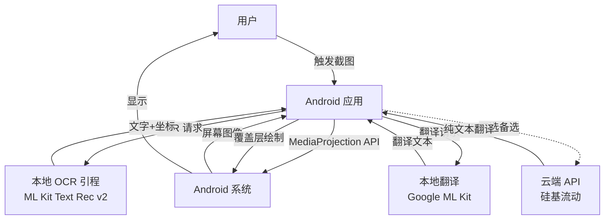
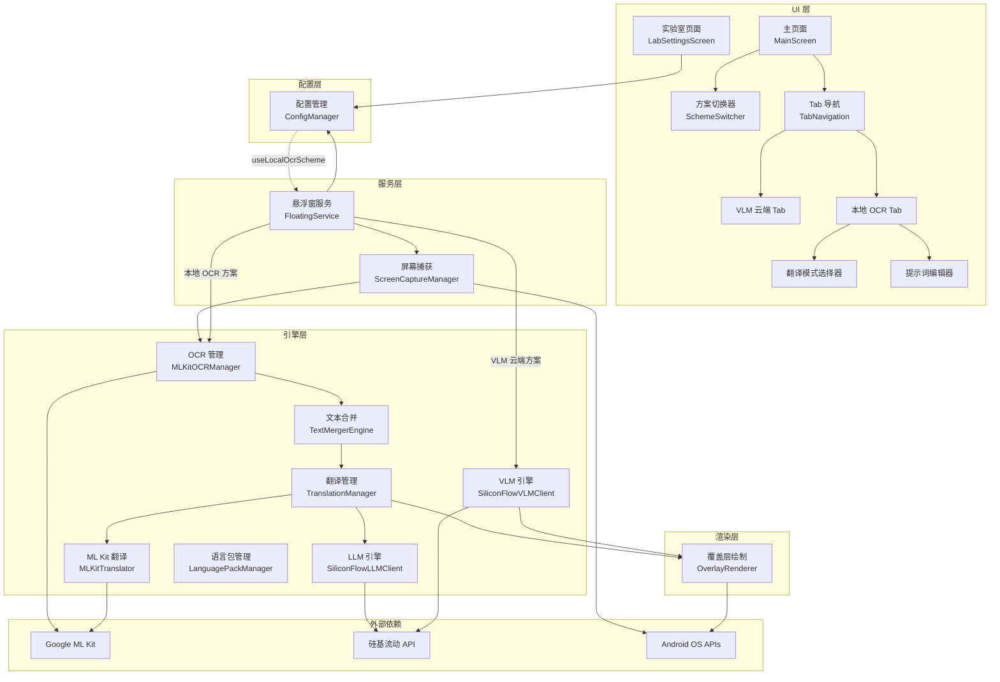
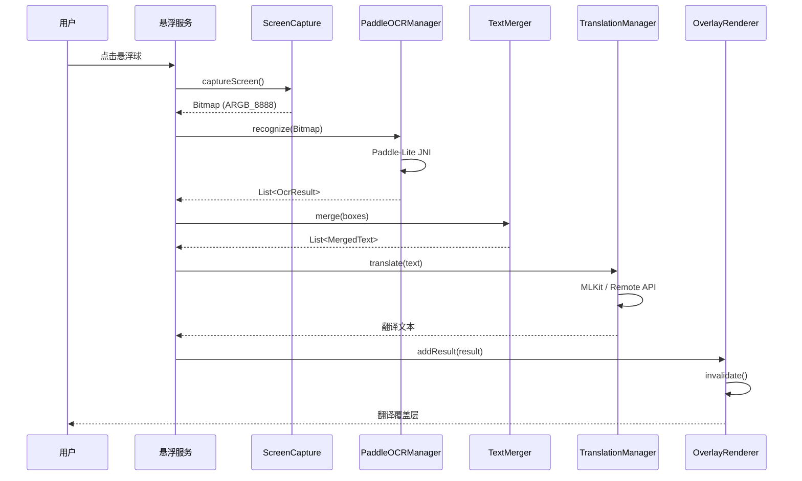
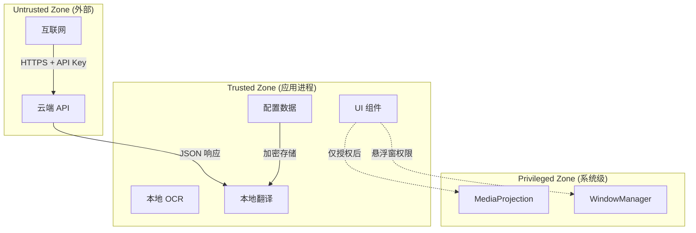
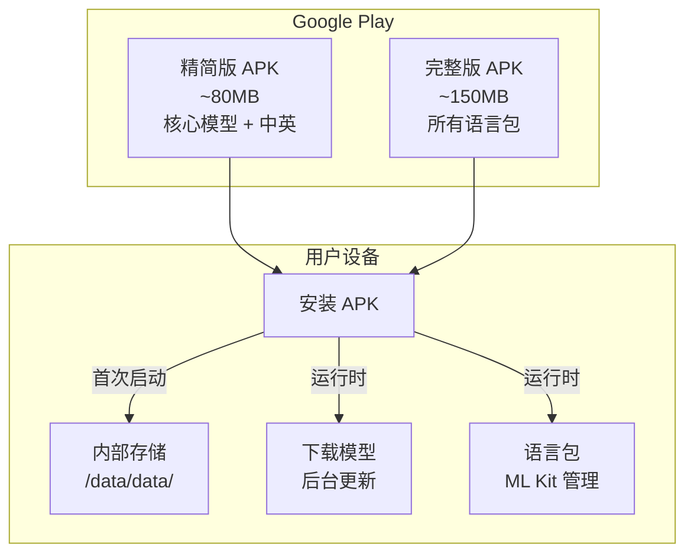

# 系统架构设计: 本地优先 OCR 翻译系统

**文档版本:** 1.1
**最后更新:** 2026-02-13
**状态:** DRAFT

---

## 1. 概述

### 1.1 系统目的

本系统是一个完全本地化的 Android 屏幕翻译应用,通过专用 OCR 引擎和轻量级翻译模型,实现离线、低延迟的跨语言屏幕内容理解。系统采用分离式架构,将文字识别 (OCR) 和机器翻译 (MT) 解耦,通过智能文本合并算法保持原文排版结构,最终在原位置绘制翻译覆盖层。

系统支持两种翻译方案:
1. **VLM 云端方案**: 使用视觉语言模型 (VLM) 一体化完成 OCR 和翻译
2. **本地 OCR 方案**: 本地 OCR + 本地 ML Kit 翻译 或 云端 LLM 翻译

### 1.2 范围

**包含内容:**
- 本地 OCR 文字识别 (Google ML Kit Text Recognition v2)
- 本地机器翻译 (Google ML Kit Translation)
- 云端 LLM 翻译 (硅基流动 Qwen2.5-7B-Instruct)
- 云端 VLM 翻译 (硅基流动 Qwen2.5-VL-32B)
- 文本框合并与横竖排检测算法
- 翻译覆盖层绘制与交互
- 悬浮窗截图与权限管理
- UI/UX 配置系统（实验室开关、Tab 导航、方案切换器）

**不包含内容:**
- 语音翻译 (未来扩展)
- 手写文字识别 (超出印刷体 OCR 范围)
- 实时相机 OCR (仅支持截图)
- 跨平台支持 (仅 Android)

### 1.3 设计原则

- **本地优先 (Local-First):** 核心功能完全离线,云端 API 仅作为高质量备选
- **性能优先 (Performance-First):** OCR <250ms,翻译 <100ms,端到端 <1s (旗舰机)
- **隐私保护 (Privacy-by-Design):** 截图数据不上传,所有 AI 推理在设备完成
- **渐进增强 (Progressive Enhancement):** 基础功能快速 MVP,高级特性逐步迭代
- **模块解耦 (Modular Design):** OCR/翻译/合并/覆盖层独立组件,便于替换和测试
- **设备适配 (Device-Aware):** 根据设备性能自动调整模型复杂度和图片分辨率
- **用户可控 (User-Controlled):** 方案选择、翻译模式由用户控制,不自动降级

---

## 2. 高层架构

### 2.1 系统上下文



**关键交互:**
1. 用户通过悬浮球触发截图
2. MediaProjection API 捕获屏幕
3. 本地 OCR 识别文字 + 坐标
4. 文本合并算法处理拆分框
5. 本地翻译引擎翻译合并文本
6. 覆盖层在原位置绘制结果

### 2.2 组件概览



**两种翻译方案数据流:**

1. **VLM 云端方案** (默认):
   ```
   截图 → VLM Engine (云端) → 覆盖层
   ```

2. **本地 OCR 方案**:
   ```
   截图 → OCR → 合并 → 翻译 (ML Kit 或 云端 LLM) → 覆盖层
   ```

### 2.3 技术栈

| 层级 | 技术 | 版本 | 用途 |
|-------|------|------|--------|
| **UI 框架** | Compose Multiplatform | 1.10.0 | 声明式 UI,跨平台基础 |
| **UI 库** | Material3 | 1.10.0-alpha05 | 设计组件和主题系统 |
| **语言** | Kotlin | 2.3.0 | 主要开发语言 |
| **OCR 引擎** | Google ML Kit Text Recognition | 19.0.0 | 本地文字识别 |
| **翻译引擎** | Google ML Kit Translation | 19.0.0 | 本地机器翻译 |
| **网络** | Ktor Client | 2.3.8 | 云端 API 通信 (可选) |
| **序列化** | Kotlinx Serialization | 1.6.2 | JSON 解析 |
| **日志** | Timber | 5.0.1 | 结构化日志 |
| **权限** | Accompanist Permissions | 0.36.0 | 权限请求封装 |
| **异步** | Kotlin Coroutines | 1.8.0 | 协程并发 |
| **构建** | Gradle (Kotlin DSL) | 8.x | 构建系统 |

---

## 3. 组件设计

### 3.1 MLKitOCRManager (OCR 管理)

**目的:** 封装 Google ML Kit Text Recognition v2 API,提供文字识别接口

**职责:**
- 初始化 ML Kit Text Recognizer (支持日韩英)
- 执行 OCR 识别 (检测 → 识别)
- 返回文字 + 像素坐标 + 置信度
- 管理识别器生命周期

**接口:**
```kotlin
interface IOcrEngine {
    suspend fun initialize(): Boolean
    suspend fun recognize(bitmap: Bitmap): List<OcrResult>
    fun release()
}

data class OcrResult(
    val text: String,
    val boundingBox: RectF,        // 像素坐标
    val confidence: Float
)
```

**依赖:**
- Google ML Kit Text Recognition v2 SDK
- Android Context (系统服务访问)

### 3.2 TextMergerEngine (文本合并引擎)

**目的:** 将 OCR 输出的多个小框智能合并为逻辑行,保持原文排版

**职责:**
- 按 Y 坐标聚类成行 (yTolerance 阈值)
- 每行内按 X 坐标排序
- X 轴合并相邻框 (xTolerance 阈值)
- 检测横竖排并分别处理
- 合并后添加 "\n" 分行

**接口:**
```kotlin
class TextMergerEngine {
    fun merge(
        boxes: List<TextBox>,
        config: MergingConfig = MergingConfig.DEFAULT
    ): List<MergedText>

    // 内部算法
    private fun clusterByYAxis(boxes: List<TextBox>, tolerance: Float): List<List<TextBox>>
    private fun mergeXAxisInLine(line: List<TextBox>, tolerance: Float): MergedText
    private fun detectDirection(line: List<TextBox>): TextDirection
}

enum class TextDirection { HORIZONTAL, VERTICAL, MIXED }

data class MergingConfig(
    val yTolerance: Float = 0.4f,      // 相对于平均高度
    val xToleranceFactor: Float = 1.5f,  // 相对于平均字符宽
    val enableDirectionDetection: Boolean = true
)

data class MergedText(
    val text: String,
    val boundingBox: RectF,
    val direction: TextDirection,
    val originalBoxes: Int  // 合并前的框数量 (调试用)
)
```

**依赖:**
- 无外部依赖 (纯算法)
- Kotlin 标准库 (用于排序、数学计算)

### 3.3 TranslationManager (翻译管理器)

**目的:** 适配本地翻译和云端 API,提供统一翻译接口

**职责:**
- 模式选择 (本地 ML Kit / 云端 SiliconFlow / 混合)
- 协程封装 (suspend 函数)
- 错误处理和自动降级
- 翻译结果缓存 (避免重复翻译)

**接口:**
```kotlin
interface ITranslationEngine {
    suspend fun translate(
        text: String,
        sourceLang: Language,
        targetLang: Language
    ): String
}

class TranslationManager(
    private val localEngine: MLKitTranslator,
    private val remoteEngine: SiliconFlowClient,
    private val config: AppConfig
) {
    suspend fun translate(
        text: String,
        sourceLang: Language,
        targetLang: Language
    ): String {
        return when (config.translationMode) {
            TranslationMode.LOCAL -> localEngine.translate(text, sourceLang, targetLang)
            TranslationMode.REMOTE -> remoteEngine.translate(text, sourceLang, targetLang)
            TranslationMode.HYBRID -> tryLocalFirst(text, sourceLang, targetLang)
        }
    }

    private suspend fun tryLocalFirst(...): String {
        return try {
            localEngine.translate(...)
        } catch (e: Exception) {
            if (config.hasRemoteApiKey) {
                remoteEngine.translate(...)
            } else {
                throw e
            }
        }
    }
}
```

**依赖:**
- Google ML Kit Translation API
- Ktor HTTP Client (云端 API)
- EncryptedSharedPreferences (API Key 存储)

### 3.4 OverlayRenderer (覆盖层绘制器)

**目的:** 在屏幕上绘制翻译结果,支持流式增量更新

**职责:**
- 归一化坐标 → 屏幕像素转换
- 计算文本布局 (自适应字号、多行排版)
- Canvas 绘制白色背景框
- 绘制翻译文本 (自动换行、省略号)
- 处理触摸事件传递 (保持原 UI 可点击)

**接口:**
```kotlin
class OverlayRenderer(
    private val context: Context,
    private val screenWidth: Int,
    private val screenHeight: Int
) {
    private val results = mutableListOf<TranslationResult>()

    fun addResult(result: TranslationResult) {
        results.add(result)
        invalidate()  // 触发重绘
    }

    fun draw(canvas: Canvas) {
        for (result in results) {
            val rect = convertToScreenRect(result.boundingBox)
            drawBackground(canvas, rect)
            drawText(canvas, rect, result.translatedText)
        }
    }

    private fun convertToScreenRect(box: BoundingBox): Rect {
        return Rect(
            (box.left * screenWidth).toInt(),
            (box.top * screenHeight).toInt(),
            (box.right * screenWidth).toInt(),
            (box.bottom * screenHeight).toInt()
        )
    }

    private fun drawText(canvas: Canvas, rect: Rect, text: String) {
        val textSize = calculateAdaptiveTextSize(rect, text)
        val layout = StaticLayout.Builder.obtain(text)
            .setTextSize(textSize)
            .build()
        // 自动换行和省略号处理
    }
}
```

**依赖:**
- Android Canvas API
- TextLayoutEngine (自定义排版引擎)
- WindowManager (添加覆盖层视图)

### 3.5 ScreenCaptureManager (屏幕捕获管理)

**目的:** 管理 MediaProjection 权限和截图流程

**职责:**
- 请求 MediaProjection 权限 (首次)
- 检测权限状态和过期
- 捕获屏幕为 Bitmap
- 图片预处理 (缩放、格式转换)

**接口:**
```kotlin
object ScreenCaptureManager {
    private var mediaProjection: MediaProjection? = null
    private var imageReader: ImageReader? = null

    fun init(context: Context) {
        val projectionManager = context.getSystemService(Context.MEDIA_PROJECTION_SERVICE) as MediaProjectionManager
        // 初始化流程
    }

    fun setMediaProjection(resultCode: Int, data: Intent?) {
        mediaProjection = projectionManager.getMediaProjection(resultCode, data)
    }

    suspend fun captureScreen(): CaptureResult = withContext(Dispatchers.IO) {
        if (mediaProjection == null) return@withContext CaptureResult.PermissionDenied

        // 创建虚拟屏幕并捕获
        val bitmap = captureVirtualScreen()
        return CaptureResult.Success(bitmap)
    }

    fun hasPermission(): Boolean {
        return mediaProjection != null && !isExpired()
    }
}

sealed class CaptureResult {
    data class Success(val imageBytes: ByteArray) : CaptureResult()
    object PermissionDenied : CaptureResult()
    data class Error(val exception: Exception) : CaptureResult()
}
```

**依赖:**
- MediaProjection API
- WindowManager (虚拟屏幕)
- ImageReader (图像缓冲)

### 3.6 UI 组件设计

#### 3.6.1 SchemeSwitcher (方案切换器)

**目的:** 在 VLM 云端和本地 OCR 方案间切换

**职责:**
- 显示当前选中的方案
- 处理用户切换操作
- 更新配置并触发流程变更

**接口:**
```kotlin
@Composable
fun SchemeSwitcher(
    useLocalOcr: Boolean,
    onSchemeChanged: (Boolean) -> Unit,
    modifier: Modifier = Modifier
) {
    Row(
        modifier = modifier
            .fillMaxWidth()
            .padding(16.dp),
        verticalAlignment = Alignment.CenterVertically
    ) {
        Text("VLM云端")
        Switch(
            checked = useLocalOcr,
            onCheckedChange = onSchemeChanged
        )
        Text("本地OCR")
    }
}
```

#### 3.6.2 TranslationModeSelector (翻译模式选择器)

**目的:** 选择本地 OCR 后的翻译方式

**职责:**
- 显示翻译模式选项（本地 ML Kit / 云端 LLM）
- 处理用户选择
- 更新配置

**接口:**
```kotlin
enum class TranslationMode {
    LOCAL_MLKIT,
    CLOUD_LLM
}

@Composable
fun TranslationModeSelector(
    currentMode: TranslationMode,
    onModeChanged: (TranslationMode) -> Unit,
    modifier: Modifier = Modifier
) {
    Column(modifier = modifier) {
        Text("翻译模式", style = MaterialTheme.typography.titleMedium)

        Row(verticalAlignment = Alignment.CenterVertically) {
            RadioButton(
                selected = currentMode == TranslationMode.LOCAL_MLKIT,
                onClick = { onModeChanged(TranslationMode.LOCAL_MLKIT) }
            )
            Text("本地 ML Kit 翻译")
        }

        Row(verticalAlignment = Alignment.CenterVertically) {
            RadioButton(
                selected = currentMode == TranslationMode.CLOUD_LLM,
                onClick = { onModeChanged(TranslationMode.CLOUD_LLM) }
            )
            Text("云端 LLM 翻译")
        }
    }
}
```

#### 3.6.3 PromptEditor (提示词编辑器)

**目的:** 编辑和持久化云端 LLM 翻译提示词

**职责:**
- 显示当前提示词
- 支持多行编辑
- 提供重置功能
- 持久化存储

**接口:**
```kotlin
@Composable
fun PromptEditor(
    prompt: String,
    onPromptChanged: (String) -> Unit,
    onReset: () -> Unit,
    modifier: Modifier = Modifier
) {
    Column(modifier = modifier) {
        Text("翻译提示词", style = MaterialTheme.typography.titleMedium)

        OutlinedTextField(
            value = prompt,
            onValueChange = onPromptChanged,
            modifier = Modifier
                .fillMaxWidth()
                .height(150.dp),
            maxLines = 10
        )

        Spacer(modifier = Modifier.height(8.dp))

        OutlinedButton(onClick = onReset) {
            Text("重置为默认提示词")
        }
    }
}
```

### 3.7 SiliconFlowLLMClient (云端 LLM 客户端)

**目的:** 调用硅基流动普通 LLM API 进行文本翻译

**职责:**
- 构建 Chat Completions 请求
- 处理自定义提示词
- 解析响应并返回翻译结果

**接口:**
```kotlin
interface ICloudLlmEngine {
    suspend fun translate(
        text: String,
        sourceLang: Language,
        targetLang: Language,
        customPrompt: String?
    ): String

    suspend fun validateApiKey(apiKey: String): Boolean
}

class SiliconFlowLLMClient(
    private val apiKey: String
) : ICloudLlmEngine {

    override suspend fun translate(
        text: String,
        sourceLang: Language,
        targetLang: Language,
        customPrompt: String?
    ): String {
        val prompt = customPrompt ?: buildDefaultPrompt(sourceLang, targetLang)
        val filledPrompt = prompt.replace("{text}", text)

        val request = ChatCompletionRequest(
            model = "Qwen/Qwen2.5-7B-Instruct",
            messages = listOf(
                ChatMessage(role = "user", content = filledPrompt)
            )
        )

        val response = apiClient.post("/v1/chat/completions", request)
        return response.choices.first().message.content
    }

    private fun buildDefaultPrompt(sourceLang: Language, targetLang: Language): String {
        return """
            请将以下${sourceLang.displayName}文本翻译成${targetLang.displayName}。
            只返回翻译结果，不要添加任何解释或说明。

            原文：
            {text}
        """.trimIndent()
    }
}
```

### 3.8 LanguagePackManager (语言包下载管理器)

**目的:** 管理翻译语言包的下载、状态检查和删除

**职责:**
- 检查语言包下载状态
- 后台下载语言包
- 显示下载进度
- 管理存储空间
- 失败自动重试

**接口:**
```kotlin
interface ILanguagePackManager {
    /**
     * 获取所有语言包状态
     */
    fun getLanguagePackStates(): Flow<List<LanguagePackState>>

    /**
     * 下载指定语言对
     */
    suspend fun downloadLanguagePair(
        sourceLang: Language,
        targetLang: Language,
        requireWifi: Boolean = true
    ): DownloadResult

    /**
     * 下载所有常用语言对
     */
    suspend fun downloadAllCommonPairs(
        requireWifi: Boolean = true,
        onProgress: (Int, Int) -> Unit  // (已下载, 总数)
    ): DownloadAllResult

    /**
     * 删除指定语言对
     */
    suspend fun deleteLanguagePair(
        sourceLang: Language,
        targetLang: Language
    ): Boolean

    /**
     * 检查是否需要下载
     */
    suspend fun needsDownload(): Boolean

    /**
     * 获取总存储占用
     */
    fun getTotalStorageUsed(): Flow<Long>
}

data class LanguagePackState(
    val sourceLang: Language,
    val targetLang: Language,
    val status: DownloadStatus,
    val sizeBytes: Long = 0,
    val progress: Float = 0f  // 0.0 - 1.0
)

enum class DownloadStatus {
    NOT_DOWNLOADED,    // 未下载
    DOWNLOADING,       // 下载中
    DOWNLOADED,        // 已下载
    FAILED,            // 下载失败
    PAUSED             // 已暂停
}

sealed class DownloadResult {
    data class Success(val sizeBytes: Long) : DownloadResult()
    data class Failed(val error: Throwable) : DownloadResult()
    object Cancelled : DownloadResult()
    object WifiRequired : DownloadResult()
}

data class DownloadAllResult(
    val successCount: Int,
    val failedCount: Int,
    val skippedCount: Int,
    val totalBytes: Long
)
```

**依赖:**
- Google ML Kit Translation API
- Android Connectivity Manager (检查 Wi-Fi)
- WorkManager (后台下载)

### 3.9 BatchTranslationManager (批量翻译管理器)

**目的:** 优化翻译性能，通过并发处理提升吞吐量

**职责:**
- 将文本列表分批处理（每批 3 个）
- 使用协程并发发起翻译请求
- 管理批次进度

**批量策略:**
```
文本列表: [Text1, Text2, Text3, Text4, Text5, Text6, Text7]
分批并发处理:
  - Batch 1: 并发请求 Text1, Text2, Text3 → 等待全部完成
  - Batch 2: 并发请求 Text4, Text5, Text6 → 等待全部完成
  - Batch 3: 并发请求 Text7 → 完成
```

**接口:**
```kotlin
interface IBatchTranslationManager {
    /**
     * 批量翻译
     * @param texts 待翻译文本列表
     * @param sourceLang 源语言
     * @param targetLang 目标语言
     * @param mode 翻译模式
     * @param onBatchComplete 批次完成回调
     * @return 翻译结果列表（保持原顺序）
     */
    suspend fun translateBatch(
        texts: List<String>,
        sourceLang: Language,
        targetLang: Language,
        mode: TranslationMode,
        onBatchComplete: ((batchIndex: Int, totalBatches: Int) -> Unit)? = null
    ): List<String>

    companion object {
        const val BATCH_SIZE = 3
    }
}

class BatchTranslationManagerImpl(
    private val mlKitTranslator: MLKitTranslator,
    private val cloudLlmClient: SiliconFlowLLMClient,
    private val config: OcrTranslationConfig
) : IBatchTranslationManager {

    override suspend fun translateBatch(
        texts: List<String>,
        sourceLang: Language,
        targetLang: Language,
        mode: TranslationMode,
        onBatchComplete: ((Int, Int) -> Unit)?
    ): List<String> = withContext(Dispatchers.Default) {
        val batches = texts.chunked(BATCH_SIZE)
        val totalBatches = batches.size
        val results = mutableListOf<String>()

        batches.forEachIndexed { index, batch ->
            // 每批使用协程并发处理
            val batchResults = translateBatchConcurrent(batch, sourceLang, targetLang, mode)
            results.addAll(batchResults)
            onBatchComplete?.invoke(index + 1, totalBatches)
        }

        results
    }

    /**
     * 并发翻译一批文本（本地和云端相同）
     * 使用协程 async 同时发起多个翻译请求
     */
    private suspend fun translateBatchConcurrent(
        batch: List<String>,
        sourceLang: Language,
        targetLang: Language,
        mode: TranslationMode
    ): List<String> = coroutineScope {
        batch.map { text ->
            async(Dispatchers.IO) {
                when (mode) {
                    TranslationMode.LOCAL_MLKIT -> {
                        mlKitTranslator.translate(text, sourceLang, targetLang)
                    }
                    TranslationMode.CLOUD_LLM -> {
                        cloudLlmClient.translate(
                            text,
                            sourceLang,
                            targetLang,
                            config.cloudLlmConfig?.customPrompt
                        )
                    }
                }
            }
        }.awaitAll()
    }
}
```

**时序图:**
```
Batch 1 (3 个并发):
├── Request 1 (Text1) ────────┐
├── Request 2 (Text2) ────────┼──> awaitAll() → 全部完成后继续
└── Request 3 (Text3) ────────┘

Batch 2 (3 个并发):
├── Request 4 (Text4) ────────┐
├── Request 5 (Text5) ────────┼──> awaitAll() → ...
└── Request 6 (Text6) ────────┘
```

---

## 4. 数据架构

### 4.1 数据流



**关键数据转换:**
1. **Bitmap → OcrResult:** 像素坐标 (检测框)
2. **OcrResult → MergedText:** Y 聚类 + X 合并,保留外接矩形
3. **MergedText → 翻译文本:** 纯文本传递 (丢弃坐标)
4. **翻译文本 + 原坐标 → TranslationResult:** 重新关联归一化坐标
5. **归一化坐标 → 屏幕像素:** 绘制时转换 (× screenWidth/Height)

### 4.2 数据模型

| 实体 | 属性 | 关系 |
|--------|------|------|
| **OcrResult** | text: String<br/>boundingBox: RectF<br/>confidence: Float | 由 MLKitOCRManager 生成<br/>输入到 TextMergerEngine |
| **MergedText** | text: String<br/>boundingBox: RectF<br/>direction: TextDirection<br/>originalBoxes: Int | 由 TextMergerEngine 生成<br/>输入到 TranslationManager |
| **TranslationResult** | originalText: String<br/>translatedText: String<br/>boundingBox: BoundingBox | 由 TranslationManager 生成<br/>输入到 OverlayRenderer |
| **BoundingBox** | left: Float (0-1)<br/>top: Float (0-1)<br/>right: Float (0-1)<br/>bottom: Float (0-1) | 归一化坐标,跨分辨率适配<br/>存储在 TranslationResult |
| **AppConfig** | ocrMode: OcrMode<br/>translationMode: TranslationMode<br/>mergingConfig: MergingConfig<br/>performanceMode: PerformanceMode | 持久化配置<br/>控制多个组件行为 |

### 4.3 状态管理

| 状态类型 | 存储 | 作用域 | 生命周期 |
|----------|--------|--------|----------|
| **MediaProjection 权限** | ScreenCaptureManager (单例) | 应用全局 | 首次授予后保持,直至应用关闭或权限撤销 |
| **OCR 识别器** | MLKitOCRManager (单例) | 应用全局 | 按需创建和释放,系统自动管理 |
| **ML Kit 语言包** | MLKitTranslator (单例) | 应用全局 | 首次下载后持久,应用退出或存储不足时释放 |
| **翻译会话状态** | TranslationSession | 会话级别 | 每次翻译开始时创建,结束或超时后清理 |
| **覆盖层显示** | FloatingService | 服务级别 | 服务启动时创建,用户关闭覆盖层或服务停止时销毁 |
| **配置数据** | EncryptedSharedPreferences | 应用全局 | 持久化存储,读取时加载到内存 |

---

## 5. 通信协议

### 5.1 组件间通信

| 类型 | 协议 | 格式 | 使用场景 |
|------|------|------|----------|
| **同步 (方法调用)** | Kotlin 函数调用 | 直接参数传递 | UI → Service、Service → Manager |
| **异步 (协程)** | Kotlin Coroutines Flow | Flow<T> / suspend 函数 | OCR 结果、翻译结果流式传递 |
| **事件 (回调)** | 监听器接口 | (result) -> Unit | 覆盖层关闭事件、权限授予事件 |
| **共享状态** | Singleton / SharedPreferences | 全局可变状态 | MediaProjection、模型加载、配置读取 |

**关键事件流:**
- `OnScreenshotTriggered` → 启动 OCR 流程
- `OnOcrComplete` → 触发文本合并
- `OnMergingComplete` → 启动翻译
- `OnTranslationComplete` → 添加到覆盖层
- `OnOverlayDismissed` → 清理会话状态

### 5.2 外部接口

| 系统 | 协议 | 认证 | 数据格式 |
|--------|------|------|--------|
| **硅基流动 API** | HTTPS (POST) | API Key in Header | JSON (Chat Completions) |
| **Google ML Kit** | SDK API | 自动管理 | 对象方法调用 |
| **Android MediaProjection** | Binder IPC | Token 验证 | Bitmap 回调 |
| **Android WindowManager** | Binder IPC | 权限验证 | View 添加/移除 |

---

## 6. 安全架构

### 6.1 安全边界



**边界说明:**
- **Trusted Zone:** 应用进程内所有组件,数据仅在内存传递
- **Untrusted Zone:** 互联网,云端 API 需验证 HTTPS 和 API Key
- **Privileged Zone:** 系统 API 需用户手动授权 (悬浮窗、截图)

### 6.2 认证与授权

| 机制 | 使用者 | 目的 |
|--------|--------|------|
| **MediaProjection Token** | ScreenCaptureManager | 验证截图权限,token 仅一次有效 |
| **悬浮窗权限** | FloatingService | 验证 SYSTEM_ALERT_WINDOW 权限 |
| **API Key 存储** | TranslationManager | 加密存储云端 API Key (Android Keystore) |
| **前台服务权限** | FloatingService | 验证通知权限 (API 28+) |
| **存储权限** | ConfigManager | 访问内部存储 (模型文件、语言包) |

### 6.3 数据保护

| 数据类型 | 保护方法 | 存储 |
|-----------|---------|--------|
| **截图 Bitmap** | 内存中短时间持有,不持久化 | RAM (处理后立即释放) |
| **OCR 文本** | 仅在会话期间存在 | RAM (应用关闭后删除) |
| **翻译结果** | 会话期间内存保留 | RAM (覆盖层关闭后清除) |
| **配置数据** | EncryptedSharedPreferences | 内部存储 (加密) |
| **云端 API Key** | Android Keystore | 系统密钥库 |
| **模型文件** | SHA256 校验和 | 内部存储 (`.nb` 文件) |
| **语言包** | 官方 SDK 管理 | 内部存储 (Google ML Kit 缓存) |

### 6.4 安全控制

- **最小权限原则:** 仅请求必需权限 (截图、悬浮窗、存储)
- **零数据上传:** 截图、OCR 文本、翻译结果均不上传服务器 (本地模式)
- **代码混淆:** R8/ProGuard 混淆发布版本,保护模型文件和 API Key
- **证书锁定:** 证书锁定权限 (截图、悬浮窗),防止后台服务滥用
- **网络安全:** 云端 API 强制 HTTPS,证书验证
- **输入验证:** 所有用户输入 (API Key、配置参数) 验证格式和范围

---

## 7. 部署架构

### 7.1 部署模型



**分发策略:**
- **单一 SKU:** 打包核心 OCR 模型 + 所有语言包 (中英日韩),APK 约 120-130MB
- **无需下载:** 所有语言包已预装,首次启动即可使用
- **精简方案:** 如需减小体积,可考虑按需打包部分语言(如仅中英),但不推荐

### 7.2 基础设施需求

| 组件 | CPU | 内存 | 存储 | 网络 |
|--------|-----|--------|--------|--------|
| **ML Kit OCR** | <1 核心 (短时间) | ~30MB (系统优化) | 无需 |
| **Google ML Kit 翻译** | <1 核心 | ~300MB (语言包) | 下载时需要 (30-60MB/语言对) |
| **覆盖层绘制** | <1 核心 | ~20MB (Bitmap + Canvas) | 无需 |
| **悬浮窗服务** | <1 核心 | ~10MB (视图 + 状态) | 无需 |
| **总计 (峰值)** | 2-3 核心 | ~360MB | Wi-Fi 下载语言包时 |

**最低设备要求:**
- **CPU:** Snapdragon 660 / Exynos 9810 或等效 (中端性能)
- **RAM:** 2GB 可用内存 (系统 + 应用)
- **存储:** 200MB 可用空间 (安装后)
- **系统:** Android 7.0 (API 24) 或更高

### 7.3 扩展性策略

| 方面 | 水平扩展 | 垂直扩展 |
|--------|----------|----------|
| **OCR 并发** | 支持多线程 OCR (批量翻译场景) | ML Kit 系统优化自动调度 |
| **翻译并发** | 协程并发翻译多个文本段 | ML Kit 限制 (内部队列) |
| **设备适配** | Google Play 设备覆盖 | ML Kit 自动优化性能 |
| **语言支持** | OCR 支持 70+ 语言 | 翻译支持 59+ 语言 |

---

## 8. 可靠性与可用性

### 8.1 失败场景

| 失败类型 | 影响 | 缓解措施 |
|----------|--------|----------|
| **MediaProjection 权限过期** | 无法截图 | 自动检测并引导重新授权,保存上次状态 |
| **OCR 模型加载失败** | 本地 OCR 不可用 | 降级到云端 API (如果已配置),提示用户检查存储空间 |
| **Google ML Kit 翻译失败** | 翻译中断 | 尝试云端 API,显示友好错误和重试按钮 |
| **云端 API 超时** | 翻译延迟 | 自动切换本地模式,提示用户检查网络 |
| **内存不足 (OOM)** | 应用崩溃 | 降低截图分辨率,释放未使用模型,显示低内存提示 |
| **语言包下载失败** | 翻译不可用 | 实现断点续传,提供手动重试入口 |
| **ML Kit OCR 初始化失败** | 本地 OCR 不可用 | 降级到云端 API (如果已配置),提示用户检查 Google Play Services |

### 8.2 恢复机制

- **自动重试:** 网络请求指数退避 (1s → 2s → 4s → 8s → 放弃)
- **状态保存:** 翻译中断时保存截图到缓存,恢复后重新处理
- **降级策略:** 本地失败 → 云端,云端失败 → 本地,最终显示错误
- **会话恢复:** 应用异常退出后,重启时恢复上次配置和未完成翻译
- **崩溃上报:** 集成 Firebase Crashlytics,自动收集崩溃堆栈和设备信息

### 8.3 备份策略

| 数据类型 | 备份频率 | 保留期限 | 位置 |
|-----------|----------|----------|------|
| **配置数据** | 每次修改 | 持久 | EncryptedSharedPreferences |
| **下载语言包** | 一次性 | 持久 | 内部存储 (ML Kit 管理) |
| **ML Kit 组件** | 一次性 | 持久 | 系统/内部存储 (ML Kit 管理) |
| **截图数据** | 不备份 | 会话结束删除 | 不持久化 (隐私保护) |
| **崩溃日志** | 实时上报 | 30 天 | Firebase/Sentry 云端 |

---

## 9. 性能考虑

### 9.1 性能需求

| 指标 | 目标值 | 测量方式 |
|--------|---------|----------|
| **OCR 延迟 (旗舰)** | <200ms | OnePlus 15 等设备实测 |
| **OCR 延迟 (中端)** | <400ms | Snapdragon 660 等设备实测 |
| **翻译延迟 (本地)** | <100ms | Google ML Kit 推理耗时 |
| **端到端延迟 (本地)** | <1s | 截图 → OCR → 合并 → 翻译 → 显示 |
| **端到端延迟 (云端)** | <5s | 包含网络往返 |
| **内存占用 (峰值)** | <400MB | Android Profiler 实测 |
| **启动时间** | <2s | 冷启动到悬浮球可点击 |
| **APK 体积** | <50MB | 发布包大小 |

### 9.2 优化策略

- **图片预处理:** 短边缩放到 672-896px (减少 OCR 计算量)
- **系统优化:** ML Kit 自动优化 CPU/GPU/NPU 调度
- **按需加载:** OCR 识别器用完即释放,不常驻内存
- **Bitmap 复用:** 缓存截图 Bitmap,避免重复解码 (覆盖层重绘)
- **协程并发:** OCR、合并、翻译使用独立协程,充分利用多核 CPU
- **离屏缓存:** 覆盖层绘制结果缓存为 Bitmap,减少频繁 invalidate()

### 9.3 缓存策略

| 数据类型 | 缓存类型 | TTL | 失效策略 |
|-----------|------------|-----|----------|
| **OCR 结果** | 内存缓存 (LRU) | 会话结束 | LRU 淘汰 (最多 100 条) |
| **翻译结果** | 内存缓存 (LRU) | 10 分钟 | LRU 淘汰 (最多 200 条) 或文本变化 |
| **语言包** | 持久化 | 永久 | Google ML Kit 管理 (自动更新) |
| **覆盖层 Bitmap** | 离屏缓存 | 会话结束 | 覆盖层关闭时释放 |

---

## 10. 监控与可观察性

### 10.1 指标

| 指标 | 类型 | 目的 | 告警阈值 |
|--------|------|------|----------|
| **OCR 延迟 (P50/P95/P99)** | 技术指标 | 性能监控 | P95>500ms |
| **翻译延迟 (P50/P95)** | 技术指标 | 性能监控 | P95>200ms |
| **端到端延迟** | 业务指标 | 用户体验监控 | >2s (本地) 或 >8s (云端) |
| **OCR 成功率** | 技术指标 | 功能可用性 | <90% |
| **翻译成功率** | 技术指标 | 功能可用性 | <95% |
| **崩溃率** | 业务指标 | 稳定性 | >0.5% 用户会话 |
| **API 失败率** | 技术指标 | 云端可用性 | >10% 请求 |
| **语言包下载失败率** | 技术指标 | 网络质量 | >20% 下载 |

### 10.2 日志

| 日志类型 | 目的地 | 保留期限 | 格式 |
|----------|-------------|-----------|------|
| **DEBUG 日志** | Logcat | 开发版本仅输出 | `[OCR] Recognized 50 boxes in 234ms` |
| **INFO 日志** | Logcat + 文件 | 7 天 | `[Translation] Translated 3 segments in 87ms` |
| **WARN 日志** | Logcat + 文件 | 30 天 | `[Merge] Large gap detected in line 5` |
| **ERROR 日志** | Logcat + 文件 + Firebase | 90 天 | `[OCR] JNI crashed with signal 11` |
| **性能日志** | 文件 (CSV) | 30 天 | timestamp,ocr_ms,merge_ms,translate_ms |

### 10.3 追踪

- **会话 ID:** 每次截图翻译生成唯一 UUID,贯穿所有日志
- **用户旅程追踪:** 截图触发 → OCR 开始/结束 → 合并开始/结束 → 翻译开始/结束 → 显示
- **崩溃堆栈:** 自动收集并上传 Firebase/Sentry,包含设备型号、Android 版本、内存状态
- **ANR 追踪:** 监控主线程阻塞 >5 秒,记录线程栈和使用率

---

## 11. 技术决策

### 11.1 关键技术

| 技术 | 理由 | 替代方案 |
|------|------|----------|
| **Google ML Kit Text Recognition v2** | 官方 SDK、70+ 语言、自动优化 CPU/GPU/NPU、持续更新 | Tesseract (老牌、精度低)、PaddleOCR (需 JNI 集成) |
| **Google ML Kit Translation** | 官方 SDK、稳定可靠、59+ 语言支持、完全离线 | NLLB-200 (需手动集成、模型大)、M2M100 (社区支持弱) |
| **Compose Multiplatform** | 现代 UI 框架、跨平台未来扩展、声明式编程 | 传统 XML View (代码冗长)、Jetpack Compose (仅 Android) |
| **Kotlin Coroutines** | 结构化并发、轻量级线程、易集成 Flow | RxJava (学习曲线陡)、Java Threads (低级、易错) |
| **归一化坐标** | 屏幕尺寸无关、简化多分辨率适配、统一内部存储 | 像素坐标 (需动态转换、复杂度高) |
| **分离架构** | OCR 和翻译解耦、可独立优化、支持混合模式 | VL 端到端模型 (集成但慢、难优化) |

### 11.2 技术债务

- [文本合并算法未充分测试] - 需收集日文/韩文/英文多种文本样本,调优 yTolerance/xTolerance 默认值
- [Google ML Kit OCR 精度未评估] - 需人工评测游戏/漫画场景识别准确度
- [Google ML Kit 翻译质量未评估] - 需人工评测游戏专有名词翻译准确度,考虑是否需要后处理或云端备选
- [横竖排检测简单] - 当前仅基于宽高比,需评估 ML Kit 输出结果,考虑后处理算法
- [流式翻译未实现] - 当前云端 API 为批量模式,需改为 SSE 流式响应以进一步降低延迟

---

## 12. 开放问题

- [Q1] Google ML Kit Text Recognition v2 在游戏/漫画场景下的识别准确度如何?
- [Q2] Google ML Kit 翻译对游戏专有名词 (技能名、装备) 的准确度如何,是否需要后处理词典?
- [Q3] 文本合并算法在复杂布局 (多列、表格) 下的表现如何,是否需要更高级的布局分析?
- [Q4] 混合模式 (本地+云端) 的切换逻辑是否应该更智能 (如长文本自动用云端,短文本用本地)?
- [Q5] 覆盖层绘制性能:大量文本框 (100+) 时是否会卡顿,是否需要离屏渲染优化?
- [Q6] 是否应该支持 OCR 结果和翻译结果的持久化缓存 (如保存最近 100 次),以便用户回看历史翻译?
- [Q7] 横竖排检测后,合并算法是否需要调整 (竖排文本按 X 轴聚类,横排按 Y 轴聚类)?
- [Q8] 云端 API 的流式响应如何与本地翻译的批量模式统一,是否需要改造成 SSE + JSON 增量解析?
- [Q9] 低端设备 (2GB RAM) 的内存优化策略是否足够,是否需要进一步降低复杂度或实现分页处理?

---

## 附录

### A. 缩写表

| 缩写 | 全称 |
|------|------|
| **OCR** | Optical Character Recognition (光学字符识别) |
| **VL** | Vision-Language Model (视觉语言模型) |
| **ML Kit** | Machine Learning Kit (Google 机器学习 SDK) |
| **JNI** | Java Native Interface (Java 本地接口) |
| **NPU** | Neural Processing Unit (神经网络处理器) |
| **API** | Application Programming Interface (应用编程接口) |
| **TTL** | Time To Live (生存时间) |
| **LRU** | Least Recently Used (最近最少使用) |
| **ANR** | Application Not Responding (应用无响应) |

### B. 参考资料

- [Google ML Kit Text Recognition 指南](https://developers.google.com/ml-kit/vision/text-recognition/v2/android)
- [Google ML Kit Translation 指南](https://developers.google.com/ml-kit/language/translation/android)
- [硅基流动 API 文档](https://docs.siliconflow.cn/)
- [Android MediaProjection 指南](https://developer.android.com/guide/topics/media/projection)
- [Compose 性能最佳实践](https://developer.android.com/jetpack/compose/performance)
- [Kotlin Coroutines 指南](https://developer.android.com/kotlin/coroutines)
- [OnePlus 15 技术规格](https://www.oneplus.com/15)

---

**文档状态:** 待评审
**下一步:** 创建 API 文档
